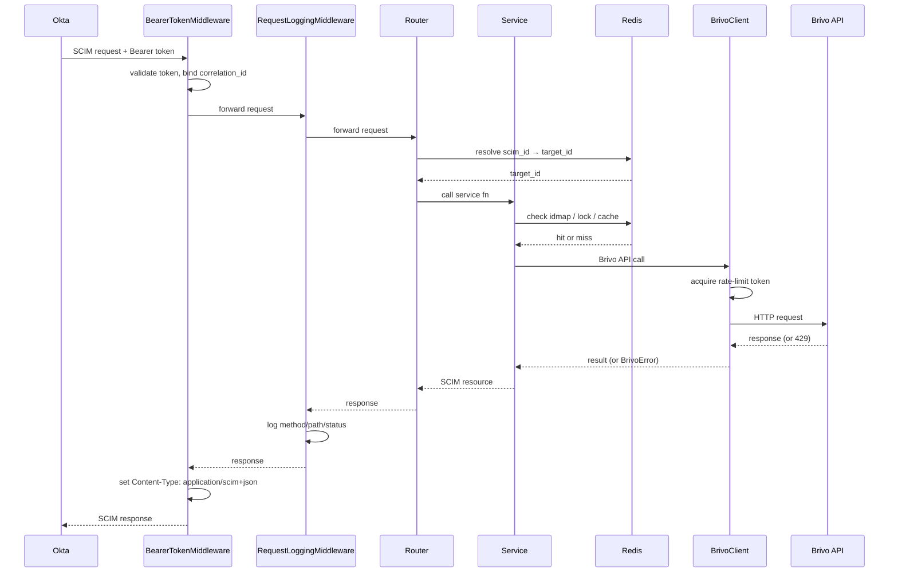
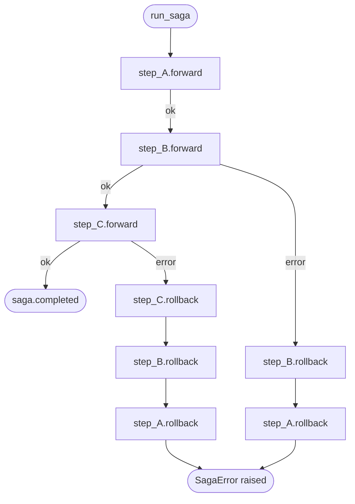

# SCIM Bridge

A SCIM 2.0 intermediary that translates Okta provisioning operations into Brivo Access API calls. Manages the full identity lifecycle (create, update, delete users and groups) with reliability guarantees under rate limits and partial failures.

## Actors

| Actor | Role | ID field |
|---|---|---|
| **Okta** | Initiates provisioning via SCIM 2.0 | `externalId` |
| **Bridge** | This app — translates SCIM → Brivo | `scim_id` (UUID v4) |
| **Brivo** | Target access control system | `target_id` (integer) |

## Request Flow



1. **Auth middleware** validates the bearer token (constant-time compare), generates a `correlation_id`, and binds it to `structlog` context so every log line in that request carries it.
2. **Logging middleware** logs method, path, and response status on every request. Body is not logged (PII).
3. **Router** parses SCIM parameters, resolves `scim_id → target_id` via Redis, calls the appropriate service function.
4. **Service** runs the business logic, often as a saga (see below).
5. **BrivoClient** enforces rate limiting and retries 429s before surfacing errors.

## Tech Stack

| Layer | Choice |
|---|---|
| Language | Python 3.14 |
| Framework | FastAPI |
| Server | Uvicorn |
| Validation | Pydantic v2 |
| Settings | pydantic-settings |
| ID store + Cache | Redis (redis-py asyncio) |
| HTTP client | httpx (AsyncClient) |
| Rate limiting | aiolimiter (leaky bucket) |
| Retries | tenacity |
| Logging | structlog |
| Testing | pytest + pytest-asyncio + httpx |
| Test mocks | fakeredis + respx |
| Infra | Docker + Compose |

## Project Structure

```
scim-bridge/
├── main.py                 ← FastAPI app, lifespan, middleware, exception handlers
├── app/
│   ├── routers/            ← SCIM endpoints: users, groups, discovery
│   ├── models/             ← Pydantic schemas (SCIM + Brivo)
│   ├── services/           ← Business logic, saga orchestrator, field mapper
│   ├── brivo/              ← BrivoClient, rate limiter, cached fetch helpers, DI
│   ├── redis/              ← ID mapping store + response cache
│   └── core/               ← Config, auth middleware, error types, logging
├── tests/
│   ├── unit/
│   └── integration/
└── docs/                   ← Architecture, specs, per-component design docs
```

## Authentication

`BearerTokenMiddleware` (Starlette `BaseHTTPMiddleware`):

- Skips auth for discovery endpoints (`/ServiceProviderConfig`, `/Schemas`, `/ResourceTypes`) — Okta probes these unauthenticated during setup.
- Compares tokens with `hmac.compare_digest` to prevent timing attacks.
- Forces `Content-Type: application/scim+json; charset=UTF-8` on every response — FastAPI defaults to `application/json`, which Okta rejects.
- Generates a `correlation_id` UUID and binds it to `structlog` contextvars before the request; all log calls in that request automatically include it.

## Saga Orchestrator

Multi-step operations against Brivo run as sagas. If any step fails, completed steps are rolled back in reverse order.

### Design



`run_saga(steps)` executes forward steps in sequence. On failure:

```
completed = [step_A, step_B]
failed    = step_C

rollbacks executed (reverse): step_C.rollback → step_B.rollback → step_A.rollback
```

The failed step's own rollback runs first (in case it partially mutated state), then completed steps unwind in reverse order. Rollback errors are swallowed and logged — the saga still raises `SagaError` to signal the operation failed.

### Sagas in use

| Operation | Steps |
|---|---|
| Create User | create at Brivo → write idmap + release lock |
| Delete User | fetch groups → remove from groups → delete user → del idmap + cache |
| Create Group | create at Brivo → write idmap + release lock → add members |
| Update Group | update name → fetch members → add new members → remove stale members |
| Delete Group | delete at Brivo → del idmap + cache |

Update User and Patch Group are simple read-modify-write operations — no saga needed.

### Crash recovery

Saga state is in-memory only. A crash loses the running saga. Recovery relies on the idempotency lock expiring (5 min TTL), after which Okta retries and a fresh saga starts.

## Rate Limiting & Retries

### Rate limiting (aiolimiter)

A single `AsyncLimiter(max_rate=N, time_period=1)` instance is created at startup and stored on `app.state`. All Brivo calls share it. Before every HTTP call:

```python
async with self._limiter:
    response = await self._http.request(...)
```

This is a leaky-bucket: at most `N` requests per second are allowed through. Excess requests wait in the async queue rather than being rejected.

### Retries (tenacity)

Retries are applied only at the `BrivoClient._call` level, and only for `BrivoRateLimitError` (HTTP 429):

```python
brivo_retry = retry(
    retry=retry_if_exception_type(BrivoRateLimitError),
    wait=wait_fixed(1),
    stop=stop_after_attempt(4),
    reraise=True,
)
```

- 4 total attempts, 1 second between each.
- Exhausted → `BrivoRateLimitError` propagates to the router → 429 to Okta.
- Other `BrivoError` types (404, 5xx) surface immediately without retrying.
- `brivo_retry` is defined at module level (not inside the class) to avoid circular import issues and enable reuse.

**Decision:** Retries live at the client layer, not the saga layer. A 429 is transient and worth retrying transparently. A 500 from Brivo indicates something is wrong with the request or Brivo state — the saga should roll back, not blindly retry.

## Redis

Redis serves two distinct roles: permanent ID mapping store and short-lived Brivo response cache.

### ID Mappings (no TTL)

Every provisioned resource has three keys written atomically in a pipeline:

| Key | Value |
|---|---|
| `idmap:brivo:scim:{type}:{scim_id}` | `{target_id, external_id, created_at}` |
| `idmap:brivo:ext:{type}:{external_id}` | `{scim_id, target_id}` |
| `idmap:brivo:tid:{type}:{target_id}` | `{scim_id, external_id}` |

Three keys for O(1) lookup in any direction. The `tid` reverse key is used during member hydration (Brivo integer ID → `scim_id` for SCIM list responses).

`created_at` is stored here because Brivo doesn't expose creation timestamps. It's used to populate `meta.created` in SCIM responses.

### Idempotency Locks (TTL 300s)

`lock:brivo:create:{type}:{external_id}` is set with `SET NX EX 300`.

- `NX` makes it atomic — only the first caller wins.
- Returns the `saga_id` of the in-flight operation.
- Guards against concurrent duplicate creates (two Okta retries racing each other).
- Separate from the idmap check: idmap guards *completed* creates, lock guards *in-progress* creates.

### Response Cache (TTL 300s)

Cache-aside for `GET /users/{id}`, `GET /groups/{id}`, and group member lists. Populated on miss, invalidated on any write to that resource.

## Field Mapping

### SCIM → Brivo (write path)

- **Email:** picks the first `primary=True` email; falls back to `emails[0]`.
- **Phone:** same logic; field is optional.
- **Active/suspended:** `active: true` → `suspended: false` (inverted).
- **Group name:** enforces Brivo's 35-character limit; raises `ScimBadRequest` if exceeded.
- **Group defaults:** `keypadUnlock=False`, `immuneToAntipassback=False`, `antipassbackResetTime=0` (Brivo requires these fields but SCIM has no equivalent).

### Brivo → SCIM (read path)

- **`userName`** = `emails[0].address` (Brivo has no separate username field).
- **`meta.version`** = SHA-256 of stable JSON serialization of the Brivo object (deterministic ETag without storing version counters).
- **`meta.created`** = pulled from idmap (see Redis section).
- **Members** = resolved from `idmap:brivo:tid:user:{target_id}` for each integer ID returned by Brivo.

### SCIM input model decisions

All SCIM input models use `extra="ignore"`. Okta sends fields that Brivo has no concept of (`password`, `displayName`, `locale`, `groups`) — these are silently dropped at deserialization rather than causing validation errors.

`externalId` is optional per the SCIM spec. The bridge falls back to `userName` (email) as the deduplication key when absent.

## SCIM Endpoints

### Discovery (unauthenticated)

- `GET /scim/v2/ServiceProviderConfig` — declares supported features: PATCH, filter, ETags. If this returns an invalid response, Okta disables PATCH and falls back to PUT-only.
- `GET /scim/v2/ResourceTypes`
- `GET /scim/v2/Schemas`

### Users (`/scim/v2/Users`)

| Method | Path | Notes |
|---|---|---|
| POST | `/` | Idempotent: returns existing user if `externalId` already mapped |
| GET | `/` | Supports `filter=userName eq "..."` (full scan + client-side match) |
| GET | `/{scim_id}` | Cache-aside fetch |
| PUT | `/{scim_id}` | Full replace |
| PATCH | `/{scim_id}` | Partial update; supports `active`, `name.*`, `userName` ops |
| DELETE | `/{scim_id}` | Removes from groups first, then deletes user, then cleans idmap |

### Groups (`/scim/v2/Groups`)

| Method | Path | Notes |
|---|---|---|
| POST | `/` | Pre-resolves all member `scim_id → target_id` before lock (bad member = 400, no state mutation) |
| GET | `/` | Supports `filter=displayName eq "..."` |
| GET | `/{scim_id}` | Fetches group + member list + hydrates member `scim_id`s |
| PUT | `/{scim_id}` | Diffs current vs desired members; adds/removes in saga |
| PATCH | `/{scim_id}` | Handles `replace`, `add`, `remove` ops |
| DELETE | `/{scim_id}` | Deletes group, then cleans idmap + cache |

**List filtering** is an in-memory full scan (paginate all from Brivo, filter client-side). Acceptable at this scale; would need server-side filtering or an index at production volume.

**List responses** exclude Brivo resources with no idmap entry (seed data, manually created Brivo users). These are silently filtered out — the bridge only manages what it provisioned.

## Logging

Structured JSON via `structlog`, stdout, ISO 8601 UTC timestamps, INFO minimum.

`correlation_id` is bound at request entry in `BearerTokenMiddleware` via `structlog.contextvars`. All log calls within that request context automatically include it — no explicit passing required.

Key log events:

| Event | Level | Fields |
|---|---|---|
| `http.request` | INFO | `method`, `path`, `status` |
| `http.error` | ERROR | `method`, `path`, `error` |
| `brivo.error` | ERROR | `method`, `path`, `brivo_status`, `error` |
| `saga.error` | ERROR | `method`, `path`, `error` |
| `saga.start/completed/failed` | INFO/ERROR | `saga_id` |
| `step.start/done/failed` | INFO/ERROR | `saga_id`, `step` |
| `rollback.error` | WARNING | `saga_id`, `step`, `error` |

Health check (`GET /health`) access logs are suppressed at the Uvicorn level (`--no-access-log`) to reduce noise.

## Running Locally

### Prerequisites

- Docker + Docker Compose
- A `.env` file (see `.env.example`)

```bash
cp .env.example .env
# set SCIM_BEARER_TOKEN=<any-secret>
docker compose up --build
```

Services:

| Service | Port | Description |
|---|---|---|
| `app` | 8000 | SCIM bridge |
| `mock-brivo` | 8001 | In-memory Brivo API simulator |
| `redis` | 6379 | ID store + cache |

`app` waits for both `redis` and `mock-brivo` to pass healthchecks before starting.

### Mock Brivo

Standalone FastAPI app with in-memory state. Configured via environment:

| Variable | Effect |
|---|---|
| `BRIVO_ERROR_RATE` | 0–1 probability of returning 500/503 |
| `BRIVO_LATENCY_MS` | Max added latency per request (ms) |
| `BRIVO_RATE_LIMIT` | Requests before simulated 429 |

Seed user (id=1, `firstName="Seed"`) is created on startup and is always present in list responses. It has no idmap entry and is filtered from SCIM list responses.

## Testing

```bash
pytest tests/          # all tests
pytest tests/unit/     # unit only (fakeredis + respx, no Docker)
pytest tests/integration/  # integration (requires running services)
```

Unit tests use `fakeredis` for Redis and `respx` to mock Brivo HTTP calls. No real network calls, no Docker required.
