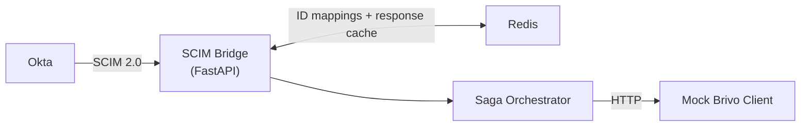

# Architecture

Automated identity lifecycle management from Okta into Brivo via SCIM 2.0.
Ensures reliability under rate limits and multi-step provisioning workflows.

## Flow

**Brivo is the source of truth for all resource state.** Every integration starts with an empty Brivo database. Redis stores permanent ID mappings (`scim_id ↔ target_id ↔ external_id`) and caches Brivo responses to absorb read traffic within the rate limit budget.

## Roles

| Actor | Role |
|---|---|
| Okta | Identity Provider (IdP) — initiates provisioning, owns `external_id` |
| SCIM Bridge | Intermediary SCIM server — owns `scim_id`, translates to target API |
| Brivo | Source of truth — authoritative resource state, owns `target_id` |

## Components

| Component | Responsibility | Detail |
|---|---|---|
| SCIM Bridge | Translate SCIM 2.0 operations to target API calls; serves reads from Brivo via Redis cache | [scim-server.md](scim-server.md) |
| Mock Brivo Client | Simulate Brivo API with configurable failure modes | [brivo-mock.md](brivo-mock.md) |
| Rate Limiter | Enforce target request rate limit | [rate-limiter.md](rate-limiter.md) |
| Saga Orchestrator | Coordinate multi-step operations with rollback | [saga.md](saga.md) |
| Redis | ID mapping store (permanent) + Brivo response cache (TTL) | [redis.md](redis.md) |

## Constraints

- Brivo is source of truth — reads go through Brivo (via Redis cache); Redis cache absorbs repeat reads
- Target system enforces a rate limit — enforce at client layer; cache prevents unnecessary Brivo calls
- ID mappings are permanent in Redis — no TTL; deleted only on resource delete
- All operations must be **idempotent** and retry-safe
- Multi-step operations must define forward + compensating (rollback) actions
- Idempotency enforced via Redis `SET NX` lock on `external_id`; crash recovery via lock expiry + IdP retry

## Deliverables

| Deliverable | Doc |
|---|---|
| FastAPI SCIM server | [scim-server.md](scim-server.md) |
| Mock Brivo client | [brivo-mock.md](brivo-mock.md) |
| Rate limiter module | [rate-limiter.md](rate-limiter.md) |
| Saga orchestrator | [saga.md](saga.md) |
| Redis integration | [redis.md](redis.md) |
| Infra (Docker + Compose) | [infra.md](infra.md) |
| Testing strategy | [testing.md](testing.md) |
| Structured logging | [logging.md](logging.md) |
