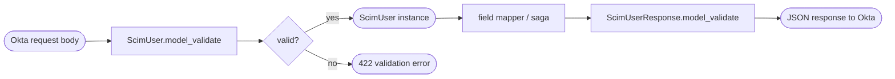

## Brainstorm

Pydantic v2 schemas for SCIM 2.0 User resource. Needed by routers (parse request bodies, serialize responses) and field mapper (translate to/from Brivo). Schema must match what Okta sends and expects — no format validation on email/phone (Okta sends strings, bridge relays). `extra='ignore'` required: Okta sends `password`, `displayName`, `locale`, `groups` which must be silently dropped. `phoneNumbers` optional (omit field if absent). `userName` = email (Brivo canonical identity). `active` maps to Brivo `suspended` (inverted). `externalId` stored in Redis only — never forwarded to Brivo.

Scope: `app/models/user.py` only. No write-path logic here.

## Story

As bridge, want typed Pydantic models for User resources, so routers can parse Okta requests and serialize Brivo responses without ad-hoc dicts.

AC:
1. `ScimUser` model parses Okta POST/PUT body; unknown fields silently dropped
2. `emails` required (min 1); `phoneNumbers` optional
3. `name` object with `givenName` and `familyName`; both optional strings
4. `active` defaults to `True` if absent
5. `externalId` optional string
6. `meta` object with `resourceType`, `location`, `created`, `lastModified`, `version`; all optional (omitted on inbound)
7. `ScimUserResponse` extends `ScimUser` with required `id` and `meta` for serialization
8. `schemas` field defaults to `["urn:ietf:params:scim:schemas:core:2.0:User"]`
9. `userName` required string; no format validation
10. Model serializes to camelCase JSON matching SCIM wire format

## Design

### Flow



### Data

```
ScimEmail:   { value: str, type: str="work", primary: bool=False }
ScimPhone:   { value: str, type: str="work", primary: bool=False }
ScimName:    { givenName: str|None, familyName: str|None }
ScimMeta:    { resourceType, location, created, lastModified, version — all str|None }

ScimUser (inbound):
  schemas: list[str] = [SCIM_USER_URN]
  userName: str                      # required
  name: ScimName | None
  emails: list[ScimEmail]            # min_length=1
  phoneNumbers: list[ScimPhone] | None
  active: bool = True
  externalId: str | None
  extra = "ignore"                   # drops password, displayName, locale, groups

ScimUserResponse (outbound, extends ScimUser):
  id: str                            # required
  meta: ScimMeta                     # required
```

### Modules

- `app/models/user.py` — new; all User schemas
- `tests/unit/test_models_user.py` — new; parse + serialize round-trip tests
