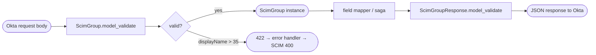

## Brainstorm

Pydantic v2 schemas for SCIM 2.0 Group resource. Needed by routers (parse request bodies, serialize responses) and field mapper (translate to/from Brivo). `displayName` max 35 chars — Brivo constraint, validated at model level (return 400 with SCIM error if exceeded). `members` always returned even when empty — Okta requires this for single-resource GET. `extra='ignore'` like User model. `externalId` stored in Redis only, never forwarded to Brivo.

Scope: `app/models/group.py` only. No write-path logic.

Related: [SCIM User Models](20260618133057_scim_user_models.md)

## Story

As the SCIM bridge, want typed Pydantic models for Group resources, so routers can parse Okta requests and serialize Brivo responses without ad-hoc dicts.

AC:
1. `ScimGroup` parses Okta POST/PUT body; unknown fields silently dropped
2. `displayName` required string, max 35 chars; 400 SCIM error if exceeded
3. `members` is `list[ScimMember]`, defaults to `[]`; `ScimMember` has required `value` (scim_id) and optional `display` (email string)
4. `externalId` optional string
5. `schemas` defaults to `["urn:ietf:params:scim:schemas:core:2.0:Group"]`
6. `meta` optional `ScimMeta` (omitted on inbound, required on outbound)
7. `ScimGroupResponse` extends `ScimGroup` with required `id` and `meta`
8. Model serializes to camelCase JSON matching SCIM wire format
9. `members` always serialized even when empty (`[]` not omitted)

## Design

### Flow



### Data

```
ScimMember:  { value: str, display: str | None = None }

ScimGroup (inbound):
  schemas: list[str] = [SCIM_GROUP_URN]
  displayName: str                      # Field(max_length=35)
  members: list[ScimMember] = []        # always serialized, never omitted
  externalId: str | None
  extra = "ignore"

ScimGroupResponse (outbound, extends ScimGroup):
  id: str                               # required
  meta: ScimMeta                        # required; imported from app.models.user
```

Note: `ScimMeta` imported from `app.models.user` until task #13 moves it to `app.models.common`.

### Modules

- `app/models/group.py` — new; all Group schemas
- `tests/unit/test_models_group.py` — new; parse + serialize + validation tests
