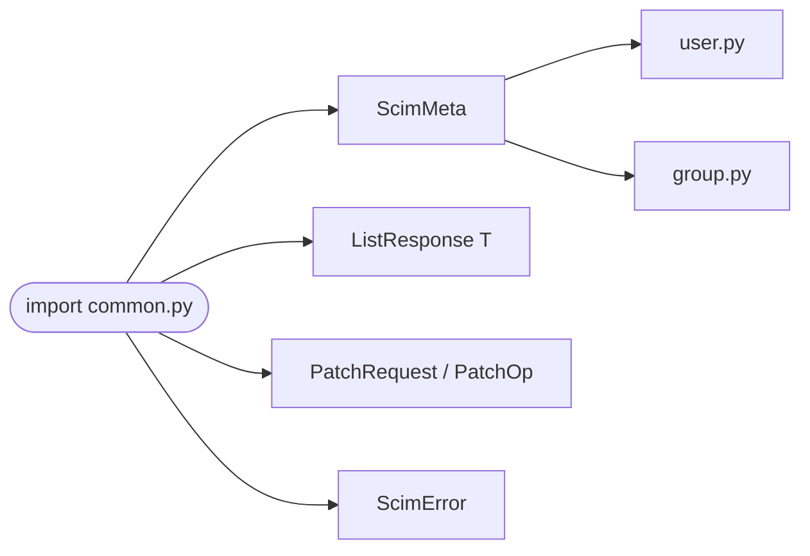

## Brainstorm

`ScimMeta` already lives in `user.py` — imported by `group.py`. Shared types need a canonical home. `common.py` is that home: move `ScimMeta` there, add `ListResponse`, `PatchOp`/`PatchRequest`, `ScimError`. Both `user.py` and `group.py` imports updated.

Constraints: `status` in `ScimError` must be `str` (RFC 7644 §3.12). `Resources` in `ListResponse` must never be omitted. `op` in `PatchOp` must normalize to lowercase. `ListResponse` is generic (serves both users and groups).

Related: [SCIM User Models](20260618133057_scim_user_models.md), [SCIM Group Models](20260618143212_scim_group_models.md)

## Story

As bridge, want shared SCIM schemas in one module so user and group models can import without circular deps.

AC:
1. `ScimMeta` moved from `user.py` to `common.py`; `user.py` and `group.py` import it from `common.py`
2. `ListResponse[T]` generic — fields: `schemas`, `totalResults`, `startIndex`, `itemsPerPage`, `Resources: list[T]`; `Resources` never omitted on empty (default `[]`)
3. `PatchOp` — `op: str` (validator lowercases), `path: str | None`, `value: Any | None`
4. `PatchRequest` — `schemas` (fixed URN), `Operations: list[PatchOp]`
5. `ScimError` — `schemas` (fixed URN), `status: str` (never int), `detail: str | None`, `scimType: str | None`
6. All models use `extra="ignore"` (Okta sends unknown fields)
7. Unit tests cover: `ListResponse` empty/non-empty, `PatchOp` op lowercasing, `ScimError` status as string

## Design

### Flow

### Data

`ListResponse[T]`:
- input: `totalResults: int`, `startIndex: int = 1`, `itemsPerPage: int`, `Resources: list[T] = []`
- output: serialized with `schemas: ["urn:ietf:params:scim:api:messages:2.0:ListResponse"]`

`PatchRequest`:
- input: `Operations: list[PatchOp]`
- output: serialized with `schemas: ["urn:ietf:params:scim:api:messages:2.0:PatchOp"]`

`ScimError`:
- input: `status: str`, `detail: str | None`, `scimType: str | None`
- output: serialized with `schemas: ["urn:ietf:params:scim:api:messages:2.0:Error"]`

### Modules

- `app/models/common.py` — new; `ScimMeta`, `ListResponse`, `PatchOp`, `PatchRequest`, `ScimError`
- `app/models/user.py` — remove `ScimMeta` def, add import from `common`
- `app/models/group.py` — change import from `user` → `common`
- `tests/unit/test_models_common.py` — new; 7 AC test cases
