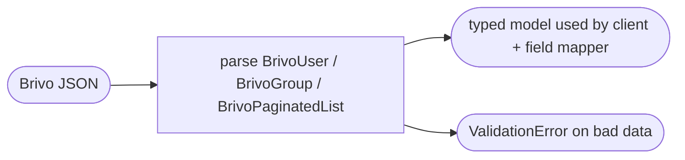

## Brainstorm

Bridge needs typed Pydantic models for Brivo API responses/requests — used only in `app/` (bridge side). Mock Brivo defines its own inline schemas independently.

Scope: `BrivoUser`, `BrivoUserWrite`, `BrivoGroup`, `BrivoGroupWrite`, `BrivoGroupRef`, `BrivoPaginatedList[T]`, `BrivoEmail`, `BrivoPhoneNumber`. All shapes from brivo-mock.md. Error handling is exception-based in `client.py` — no Pydantic error model needed.

Constraints: `name` max 35 chars on group. `id` is int (Brivo assigns). `created`/`updated` are ISO timestamps, read-only. `POST` body omits `id`, `created`, `updated`.

Related: [SCIM User Models](20260618133057_scim_user_models.md), [SCIM Group Models](20260618143212_scim_group_models.md)

## Story

As bridge developer, want typed Brivo API models, so field mapper and Brivo client have validated input/output shapes.

AC:
1. `BrivoEmail` has `address: str` and `type: str`
2. `BrivoPhoneNumber` has `number: str` and `type: str`
3. `BrivoUser` has `id: int`, `firstName: str`, `lastName: str`, `emails: list[BrivoEmail]`, `phoneNumbers: list[BrivoPhoneNumber]`, `suspended: bool`, `created: datetime`, `updated: datetime`; `externalId` optional (bridge never sets it, but may receive it)
4. `BrivoUserWrite` omits `id`, `created`, `updated`; used for POST and PUT bodies
5. `BrivoGroup` has `id: int`, `name: str` (max 35 chars), `keypadUnlock: bool`, `immuneToAntipassback: bool`, `antipassbackResetTime: int`
6. `BrivoGroupWrite` omits `id`; used for POST and PUT bodies
7. `BrivoGroupRef` has `id: int`, `name: str`; used in paginated group list and user's groups response
8. `BrivoPaginatedList[T]` has `data: list[T]`, `offset: int`, `pageSize: int`, `count: int`
9. No `model_config` needed — field names already match Brivo JSON camelCase directly; no aliases required
11. Unit tests cover: field defaults, validation (group name > 35 chars raises), round-trip from JSON fixture matching brivo-mock.md schemas

## Design

### Flow

### Data

User read: `{ id: int, externalId?: str, firstName: str, lastName: str, emails: list, phoneNumbers: list, suspended: bool, created: datetime, updated: datetime }`
User write: same minus `id`, `created`, `updated`
Group read: `{ id: int, name: str(≤35), keypadUnlock: bool, immuneToAntipassback: bool, antipassbackResetTime: int }`
Group write: same minus `id`
GroupRef: `{ id: int, name: str }`
Paginated: `{ data: list[T], offset: int, pageSize: int, count: int }`

### Modules

- `app/models/brivo.py` — new file, all Brivo models
- `tests/unit/test_models_brivo.py` — new file, unit tests
