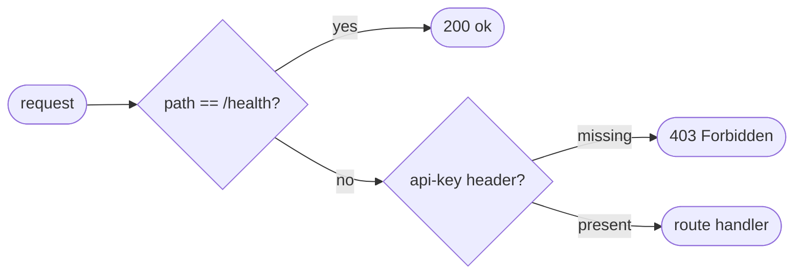

## Brainstorm

Task #15: scaffold standalone mock Brivo FastAPI service — health check, in-memory store, inline schemas (no imports from `app/`).

Scope: only skeleton — no user/group endpoints (tasks #16–17), no behavior simulation (#18). Independently testable with `curl /health` after this task.

Constraints:
- Runs in `Dockerfile.brivo` on port 8001
- Inline Pydantic schemas only (no shared `app/` imports)
- In-memory dict store (users + groups) seeded in lifespan
- Auth: any non-empty `api-key` header accepted
- Error body: `{ "code": int, "message": str }`

Related: [Brivo Models](20260618195155_brivo_models.md)

## Story

As bridge developer, want runnable mock Brivo skeleton, so integration tests have stable target before real endpoints exist.

AC:
1. `GET /health` returns `{"status": "ok"}` with 200
2. Service starts on port 8001 via `Dockerfile.brivo` / `docker-compose up`
3. In-memory store initialized at startup: `users: dict[int, BrivoUser]`, `groups: dict[int, BrivoGroup]`
4. Inline Pydantic models defined: `BrivoUser`, `BrivoGroup`, `BrivoEmail`, `BrivoPhone`, `BrivoError`, `BrivoPage`
5. Auth middleware: requests without `api-key` header return `403 {"code": 403, "message": "Forbidden"}`
6. `GET /health` is exempt from auth check
7. Auto-increment ID counter per resource type (users, groups) seeded at startup
8. `curl http://localhost:8001/health` returns 200 without api-key header

## Design

### Flow



### Data

Store (module-level, initialized at startup):
```
users: dict[int, BrivoUser] = {}
groups: dict[int, BrivoGroup] = {}
_counters: dict[str, int] = {"users": 0, "groups": 0}
```

Inline models (no imports from `app/`):
```
BrivoEmail(address: str, type: str = "work")
BrivoPhone(number: str, type: str = "mobile")
BrivoUser(id: int, firstName: str, lastName: str, emails: list[BrivoEmail],
          phoneNumbers: list[BrivoPhone] = [], suspended: bool = False,
          created: datetime, updated: datetime)
BrivoGroup(id: int, name: str, keypadUnlock: bool = False,
           immuneToAntipassback: bool = False, antipassbackResetTime: int = 0)
BrivoError(code: int, message: str)
BrivoPage[T](data: list[T], offset: int, pageSize: int, count: int)
```

### Modules

- `mock_brivo/main.py` — expand: add inline models, store, auth middleware, lifespan
- `tests/unit/test_mock_brivo_skeleton.py` — new: health 200 no-auth, missing api-key → 403
