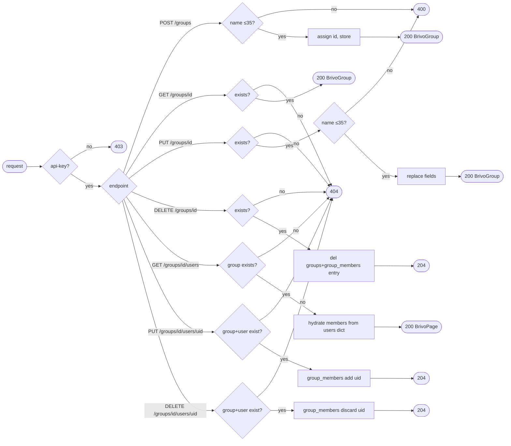

## Brainstorm

Task #17: fill remaining 7 group endpoints in mock Brivo service.

From #16, `mock_brivo/main.py` already has: `BrivoGroup` model (`id`, `name`, `keypadUnlock`, `immuneToAntipassback`, `antipassbackResetTime`), `groups: dict[int, BrivoGroup]` store, `group_members: dict[int, set[int]]` store, `next_id("groups")` counter, and `GET /v1/api/groups` list stub. Need: `BrivoGroupIn` write model + 7 remaining endpoints.

Scope: group CRUD + member add/remove + list-users-in-group. Behavior simulation (latency, error rate, 429) is task #18 — out of scope.

Constraints:
- `POST /groups` returns 200 not 201 (Brivo quirk)
- `DELETE /groups/{id}` and member ops (`PUT/DELETE /groups/{id}/users/{uid}`) return 204 no body
- Group `name` max 35 chars — validate, return 400 on violation
- Groups have no `externalId` or timestamps (`created`/`updated`)
- `GET /v1/api/groups/{groupId}/users` returns standard `BrivoPage[BrivoUser]`

Related: [Mock Brivo User Endpoints](20260619232153_mock_brivo_user_endpoints.md), [Mock Brivo Skeleton](20260619184934_mock_brivo_skeleton.md)

## Story

As bridge developer, want complete mock Brivo group API, so bridge client can be tested end-to-end without real Brivo.

AC:
1. `POST /v1/api/groups` creates group, returns 200 with full `BrivoGroup`; returns 400 if `name` > 35 chars
2. `GET /v1/api/groups/{groupId}` returns group or 404
3. `PUT /v1/api/groups/{groupId}` replaces group fields, returns 200; returns 400 if `name` > 35 chars; 404 if not found
4. `DELETE /v1/api/groups/{groupId}` removes group + clears its `group_members` entry, returns 204; 404 if not found
5. `GET /v1/api/groups/{groupId}/users` returns `BrivoPage[BrivoUser]` of members; 404 if group not found
6. `PUT /v1/api/groups/{groupId}/users/{userId}` adds user to group, returns 204; 404 if group or user not found
7. `DELETE /v1/api/groups/{groupId}/users/{userId}` removes user from group, returns 204; 404 if group or user not found
8. All endpoints reject missing `api-key` header with 403
9. Test file covers all 7 endpoints + 400/404/403 cases

## Design

### Flow

### Data

POST/PUT body: `BrivoGroupIn` `{ name: str, keypadUnlock: bool = False, immuneToAntipassback: bool = False, antipassbackResetTime: int = 0 }`

`GET /groups/{id}/users` response: `BrivoPage[BrivoUser]` — same paginated shape as `GET /users`

Name validation: inline `len(body.name) > 35` check in endpoint; no Pydantic validator (keeps pattern consistent with user endpoints which do no field-level validation).

### Modules

- `mock_brivo/main.py` — add `BrivoGroupIn` model; implement 7 endpoints (POST, GET, PUT, DELETE groups + GET/PUT/DELETE group members)
- `tests/unit/test_mock_brivo_groups.py` — new file; covers all 7 endpoints + 400/404/403 cases

## Summary

Added 7 group endpoints to mock Brivo: POST/GET/PUT/DELETE /v1/api/groups and GET/PUT/DELETE /v1/api/groups/{id}/users. Added `BrivoGroupIn` write model. PUT group does full field replace (no `model_copy` — groups have no timestamp to preserve). DELETE group calls `group_members.pop(groupId, None)` to clean the membership index atomically. Member add/remove validate both group and user exist before mutating `group_members`.

[mock_brivo/main.py](mock_brivo/main.py) [tests/unit/test_mock_brivo_groups.py](tests/unit/test_mock_brivo_groups.py)
