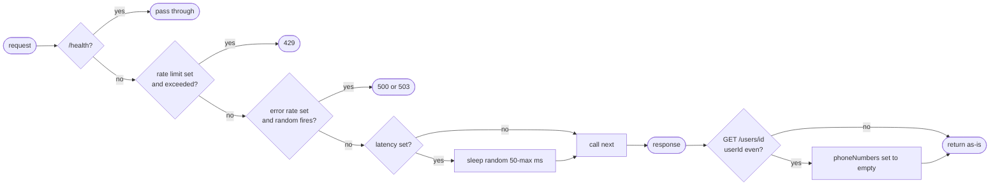

## Brainstorm

Task #18: add behavior simulation to mock Brivo — latency, random errors, partial responses, and 429 rate limiting.

`mock_brivo/main.py` currently returns instant, always-successful responses. This task adds a FastAPI middleware layer that injects realistic failure modes so the bridge client and rate limiter can be tested against adversarial conditions.

Scope: 4 behaviors — random latency, random 500/503 errors, deterministic partial responses on `GET /users/{userId}`, and 429 when request rate exceeds threshold. All configurable via env vars; safe defaults allow existing tests to pass with env vars unset.

Constraints:
- `BRIVO_LATENCY_MS` (default 300): random delay in range `[50, BRIVO_LATENCY_MS]` ms per request
- `BRIVO_ERROR_RATE` (default 0.1): probability 0–1 of returning 500 or 503 instead of real response
- `BRIVO_RATE_LIMIT` (default 20): req/sec threshold; returns 429 when exceeded (in-memory sliding window)
- Partial responses deterministic per `userId` (`userId % 2 == 0` → omit `phoneNumbers`) — `GET /v1/api/users/{userId}` only
- Env vars read per-request via `os.getenv` — tests can patch `os.environ` without restart
- `/health` exempt from all simulation (already exempt from auth middleware)
- Existing tests must still pass — env vars default to "off" behavior (0ms latency, 0 error rate, no rate limit)

Related: [Mock Brivo Skeleton](20260619184934_mock_brivo_skeleton.md)

## Story

As bridge developer, want mock Brivo to simulate realistic failure modes, so bridge client and rate limiter can be tested against adversarial conditions without real Brivo.

AC:
1. Each non-`/health` request sleeps `random(50, BRIVO_LATENCY_MS)` ms; if `BRIVO_LATENCY_MS` unset or `<= 0`, no sleep
2. Each non-`/health` request has `BRIVO_ERROR_RATE` probability (0–1) of returning 500 or 503 instead of real response; if unset or `0`, no errors injected
3. When request rate exceeds `BRIVO_RATE_LIMIT` req/sec, returns 429 `{"code": 429, "message": "Rate limit exceeded"}`; if `BRIVO_RATE_LIMIT` unset or `0`, no rate limiting
4. `GET /v1/api/users/{userId}`: if `userId % 2 == 0`, response omits `phoneNumbers` field (set to `[]`)
5. All simulation behaviors are independent — rate limit fires before latency/error; error fires before partial response
6. `/health` exempt from all simulation
7. Existing tests pass unchanged (env vars unset → simulation disabled)
8. Test file covers: latency applied, error rate fires, 429 triggered, partial response for even userId, normal response for odd userId, health exempt

## Design

### Flow

### Data

Env vars read per-request via `os.getenv`, default = disabled:

| Var | Type | Disabled when | Behavior |
|---|---|---|---|
| `BRIVO_LATENCY_MS` | int | unset or <= 0 | sleep `random.randint(50, val)` ms |
| `BRIVO_ERROR_RATE` | float | unset or <= 0 | `random.random() < val` then 500 or 503 |
| `BRIVO_RATE_LIMIT` | int | unset or <= 0 | sliding window deque; 429 when exceeded |

Rate limit tracking: `_request_times: collections.deque` stores `time.monotonic()` per request; evict entries older than 1s before comparing to threshold.

Partial response: handled in `get_user` endpoint directly, not middleware — avoids reading and rewriting response stream.

### Modules

- `mock_brivo/main.py` — add imports (`asyncio`, `collections`, `os`, `random`, `time`); add `_request_times` deque; add simulation middleware (registered after auth = outermost in Starlette = runs first); modify `get_user` to set `phoneNumbers=[]` for even `userId`
- `tests/unit/test_mock_brivo_behavior.py` — new file; patches `os.environ` per test to enable each behavior

## Summary

Added behavior simulation middleware to mock Brivo. Middleware runs outermost (registered last in Starlette) — fires before auth, skips `/health`. Rate limiting uses module-level `collections.deque` for sliding 1s window; env vars read per-request so tests patch `os.environ` without restart. Partial response handled in `get_user` endpoint via `model_copy` — avoids stream rewriting in middleware. `latency_ms` clamps minimum to `min(50, val)` to guard against `BRIVO_LATENCY_MS < 50`.

[mock_brivo/main.py](mock_brivo/main.py) [tests/unit/test_mock_brivo_behavior.py](tests/unit/test_mock_brivo_behavior.py)
