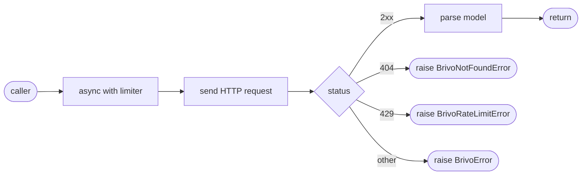

## Brainstorm

Task #19: implement `app/brivo/client.py` — async httpx wrapper covering all 14 Brivo endpoints.

`app/brivo/__init__.py` exists (empty). `app/models/brivo.py` has Pydantic models for Brivo resources. The client sits between the saga orchestrator and the Brivo API (real or mock).

Scope: `BrivoClient` class wrapping all user and group endpoints (list, get, create, update, delete, member add/remove). No saga logic, no SCIM mapping — pure Brivo API surface. Rate limiter (#20) required constructor arg.

Constraints:
- `httpx.AsyncClient` injected (singleton via FastAPI lifespan) — not created per-call
- Raises typed exceptions: `BrivoNotFoundError`, `BrivoRateLimitError`, `BrivoError` — all in `client.py`
- `limiter: AsyncLimiter` required (from aiolimiter); always used as async context manager before each call
- Auth headers (`api-key`, `Authorization`) set on the injected `AsyncClient` (not repeated per call)
- Uses `BrivoUser`, `BrivoGroup`, `BrivoPage` models from `app/models/brivo.py` for response parsing
- `POST` returns 200 not 201 (Brivo quirk — already handled by mock)
- Tests use `respx` to mock httpx calls (per CLAUDE.md tech stack)

Related: [Brivo Models](20260618195155_brivo_models.md)

## Story

As saga orchestrator, want typed async Brivo API client, so I can call Brivo endpoints and get parsed models without handling HTTP details.

AC:
1. `BrivoClient(http: AsyncClient, limiter: AsyncLimiter)` — constructor; `limiter` always used as async context manager before each call
2. `list_users(offset, page_size)` → `BrivoPaginatedList[BrivoUser]`
3. `create_user(body: BrivoUserWrite)` → `BrivoUser`
4. `get_user(user_id)` → `BrivoUser`
5. `update_user(user_id, body: BrivoUserWrite)` → `BrivoUser`
6. `delete_user(user_id)` → `None` (204)
7. `list_user_groups(user_id)` → `list[BrivoGroupRef]` (special response shape `{"count": N, "data": [...]}`)
8. `list_groups(offset, page_size)` → `BrivoPaginatedList[BrivoGroup]`
9. `create_group(body: BrivoGroupWrite)` → `BrivoGroup`
10. `get_group(group_id)` → `BrivoGroup`
11. `update_group(group_id, body: BrivoGroupWrite)` → `BrivoGroup`
12. `delete_group(group_id)` → `None` (204)
13. `list_group_users(group_id, offset, page_size)` → `BrivoPaginatedList[BrivoUser]`
14. `add_user_to_group(group_id, user_id)` → `None` (204)
15. `remove_user_from_group(group_id, user_id)` → `None` (204)
16. `404` → raises `BrivoNotFoundError`; `429` → raises `BrivoRateLimitError`; other non-2xx → raises `BrivoError`
17. All exception classes defined in `app/brivo/client.py`
18. Test file uses `respx` to mock httpx; covers happy path + 404/429/5xx for representative methods

## Design

### Flow



### Data

```python
class BrivoError(Exception): ...          # base: non-2xx
class BrivoNotFoundError(BrivoError): ... # 404
class BrivoRateLimitError(BrivoError): ... # 429

class BrivoClient:
    def __init__(self, http: AsyncClient, limiter: AsyncLimiter): ...
    # internal
    async def _call(self, method, url, **kwargs) -> Response: ...
    async def _check(self, r: Response) -> Response: ...
    # user methods
    async def list_users(self, offset=0, page_size=20) -> BrivoPaginatedList[BrivoUser]: ...
    async def create_user(self, body: BrivoUserWrite) -> BrivoUser: ...
    async def get_user(self, user_id: int) -> BrivoUser: ...
    async def update_user(self, user_id: int, body: BrivoUserWrite) -> BrivoUser: ...
    async def delete_user(self, user_id: int) -> None: ...
    async def list_user_groups(self, user_id: int) -> list[BrivoGroupRef]: ...
    # group methods
    async def list_groups(self, offset=0, page_size=20) -> BrivoPaginatedList[BrivoGroup]: ...
    async def create_group(self, body: BrivoGroupWrite) -> BrivoGroup: ...
    async def get_group(self, group_id: int) -> BrivoGroup: ...
    async def update_group(self, group_id: int, body: BrivoGroupWrite) -> BrivoGroup: ...
    async def delete_group(self, group_id: int) -> None: ...
    async def list_group_users(self, group_id: int, offset=0, page_size=20) -> BrivoPaginatedList[BrivoUser]: ...
    async def add_user_to_group(self, group_id: int, user_id: int) -> None: ...
    async def remove_user_from_group(self, group_id: int, user_id: int) -> None: ...
```

Note: `page_size` maps to Brivo query param `pageSize` (camelCase). `_call` always acquires limiter before HTTP dispatch. `_check` maps status → exception.

### Modules

- `app/brivo/client.py` — new file; exceptions + `BrivoClient`
- `tests/unit/test_brivo_client.py` — new file; `respx` mocks; covers list/get/create/delete users+groups + member ops + 404/429/5xx

## Summary

`BrivoClient` wraps all 14 Brivo endpoints via injected `httpx.AsyncClient`. `limiter: AsyncLimiter` is required — always acquired before each HTTP dispatch. `_check` maps 404→`BrivoNotFoundError`, 429→`BrivoRateLimitError`, other non-2xx→`BrivoError`. `page_size` parameter serialized as `pageSize` in query string. Tests use `respx.mock` + `make_limiter(1000)` (high-rate no-op for tests).

[app/brivo/client.py](app/brivo/client.py) [tests/unit/test_brivo_client.py](tests/unit/test_brivo_client.py)
