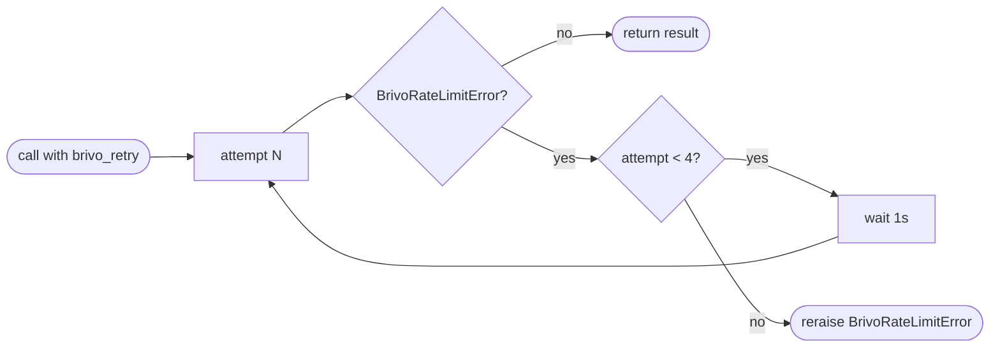

## Brainstorm

Task #20: implement `app/brivo/rate_limiter.py` — leaky bucket throttling + 429 retry for Brivo API calls.

`BrivoClient` (#19) already accepts `limiter=None` arg (used as `async with limiter:` before each HTTP call). This task provides the actual limiter plus a tenacity retry decorator for 429 responses.

Scope: two exports — `make_limiter()` factory (creates `aiolimiter.AsyncLimiter` from `BRIVO_RATE_LIMIT` env var, called at app startup) and `brivo_retry` tenacity decorator (catches `BrivoRateLimitError`, waits 1s, retries up to 3 times, propagates on exhaustion). The decorator is applied to `BrivoClient` methods.

Constraints:
- `AsyncLimiter(max_rate=BRIVO_RATE_LIMIT, time_period=1)` — leaky bucket, reads `settings.brivo_rate_limit` (default 20)
- Retry: 3 retries (4 total attempts), 1s fixed wait between each, catches `BrivoRateLimitError` only
- On exhaustion: re-raises `BrivoRateLimitError` — caller (saga) handles propagation to Okta
- Limiter instantiated at app startup and passed to `BrivoClient` constructor — not module-level singleton
- Tests use `fakeredis` or plain mocks — no HTTP needed for unit tests here

Related: [Brivo Client](20260620003030_brivo_client.md)

## Story

As bridge, want transparent rate limiting and 429 retry, so bridge never exceeds Brivo's 20 req/sec limit and absorbs transient 429s without surfacing them to Okta.

AC:
1. `make_limiter(max_rate: int) -> AsyncLimiter` — returns `aiolimiter.AsyncLimiter(max_rate=max_rate, time_period=1)`; callers pass `settings.brivo_rate_limit`
2. `brivo_retry` — tenacity `retry` decorator; catches `BrivoRateLimitError` only; waits 1s fixed between attempts; stops after 3 retries (4 total attempts)
3. On 3rd retry exhaustion, `BrivoRateLimitError` propagates to caller unchanged
4. `brivo_retry` does not catch `BrivoNotFoundError`, `BrivoError`, or any other exception
5. `make_limiter` importable from `app.brivo.rate_limiter`; `brivo_retry` importable from `app.brivo.client` (lives alongside `BrivoRateLimitError` to avoid circular imports)
6. Test: `make_limiter` returns `AsyncLimiter` with correct `max_rate`
7. Test: `brivo_retry` retries exactly 3 times then raises on persistent 429
8. Test: `brivo_retry` does not retry on `BrivoNotFoundError`
9. Test: `brivo_retry` succeeds when 429 clears on 2nd attempt

## Design

### Flow



### Data

```python
# client.py — brivo_retry lives here to avoid circular import with rate_limiter.py
brivo_retry = retry(
    retry=retry_if_exception_type(BrivoRateLimitError),
    wait=wait_fixed(1),
    stop=stop_after_attempt(4),  # 1 original + 3 retries
    reraise=True,
)

class BrivoClient:
    @brivo_retry
    async def _call(self, method, url, **kwargs): ...

# rate_limiter.py exports:
def make_limiter(max_rate: int) -> AsyncLimiter:
    return AsyncLimiter(max_rate=max_rate, time_period=1)
```

`brivo_retry` applied to `BrivoClient._call` — all Brivo HTTP calls automatically retry on 429. `AsyncLimiter` is compatible with `BrivoClient(limiter=...)` since it supports `async with`.

### Modules

- `app/brivo/rate_limiter.py` — `make_limiter` only
- `app/brivo/client.py` — `brivo_retry` decorator + `@brivo_retry` on `BrivoClient._call`
- `tests/unit/test_rate_limiter.py` — mock async functions; verify retry count + reraise + no-retry on non-429

## Summary

`make_limiter(max_rate)` wraps `aiolimiter.AsyncLimiter` — compatible with `BrivoClient(limiter=...)` since `AsyncLimiter` supports `async with`. `brivo_retry` is a module-level tenacity `retry` decorator (`stop_after_attempt(4)`, `wait_fixed(1)`, `reraise=True`) — lives in `client.py` (alongside `BrivoRateLimitError`) and applied as `@brivo_retry` on `BrivoClient._call`, so all Brivo calls retry automatically. Tests patch `asyncio.sleep` to skip 1s waits; verify exact retry count via call counter.

[app/brivo/client.py](app/brivo/client.py) [app/brivo/rate_limiter.py](app/brivo/rate_limiter.py) [tests/unit/test_rate_limiter.py](tests/unit/test_rate_limiter.py)
