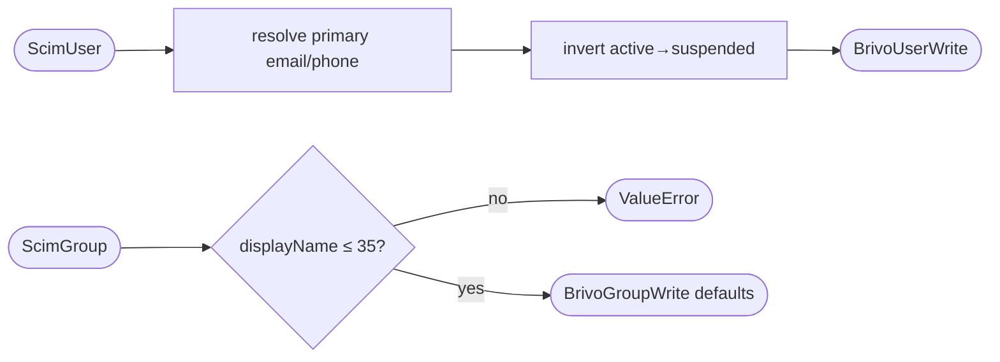

## Brainstorm

Task #21: pure translation layer — `ScimUser` → `BrivoUserWrite` and `ScimGroup` → `BrivoGroupWrite`. No HTTP, no Redis. Two functions.

Write path (SCIM→Brivo) only; read path (#22) and member hydration (#23) are separate tasks.

Constraints:
- `active` inverts to `suspended` (`active=True` → `suspended=False`)
- `emails[primary].value` → `emails[0].address`; `phoneNumbers[primary].value` → `phoneNumbers[0].number`; fall back to first element if none marked primary
- `displayName` max 35 chars enforced here (raise `ValueError` if exceeded) — router catches and returns 400
- `externalId` and `members` dropped — not forwarded to Brivo
- All existing Pydantic models (`BrivoUserWrite`, `BrivoGroupWrite`, `ScimUser`, `ScimGroup`) already exist — mapper just calls their constructors

Related: [Brivo Client](20260620003030_brivo_client.md) [SCIM User Models](20260618133057_scim_user_models.md) [SCIM Group Models](20260618143212_scim_group_models.md)

## Story

As bridge, want pure SCIM→Brivo field translation, so Brivo calls get correctly shaped payloads without mapping logic scattered across callers.

AC:
1. `scim_user_to_brivo(user: ScimUser) -> BrivoUserWrite` — maps `name.givenName→firstName`, `name.familyName→lastName`, `active→suspended` (inverted)
2. Primary email resolved: `emails` list → first entry with `primary=True`; fall back to `emails[0]` if none marked primary; result → `emails[0].address` in Brivo
3. Primary phone resolved: same fallback logic as email → `phoneNumbers[0].number`; if no phone numbers, Brivo `phoneNumbers=[]`
4. `externalId`, `userName`, `groups`, and any other SCIM-only fields not forwarded to Brivo
5. `scim_group_to_brivo(group: ScimGroup) -> BrivoGroupWrite` — maps `displayName→name`
6. `displayName` > 35 chars raises `ValueError` with message `"Group displayName exceeds Brivo's 35-character limit"`
7. `members` not included in `BrivoGroupWrite` — member ops are separate Brivo calls
8. Both functions importable from `app.services.field_mapper`
9. Test: user mapping covers active/suspended inversion
10. Test: primary email fallback (no primary flag → use first)
11. Test: phone numbers absent → `phoneNumbers=[]`
12. Test: group name mapped, 35-char limit enforced

## Design

### Flow



### Data

```python
# user
primary_email = next((e for e in user.emails if e.primary), user.emails[0])
phones = user.phoneNumbers or []
primary_phone = next((p for p in phones if p.primary), phones[0] if phones else None)

BrivoUserWrite(
    firstName=user.name.givenName if user.name else "",
    lastName=user.name.familyName if user.name else "",
    emails=[BrivoEmail(address=primary_email.value, type=primary_email.type)],
    phoneNumbers=[BrivoPhoneNumber(number=primary_phone.value, type=primary_phone.type)] if primary_phone else [],
    suspended=not user.active,
)

# group — BrivoGroupWrite has no SCIM equivalent for keypadUnlock/immuneToAntipassback/antipassbackResetTime → default False/False/0
BrivoGroupWrite(name=group.displayName, keypadUnlock=False, immuneToAntipassback=False, antipassbackResetTime=0)
```

### Modules

- `app/services/field_mapper.py` — new file; `scim_user_to_brivo`, `scim_group_to_brivo`
- `tests/unit/test_field_mapper.py` — new file

## Summary

Two pure functions: `scim_user_to_brivo` maps `ScimUser→BrivoUserWrite` (name fields, email/phone primary resolution with fallback, `active` inverted to `suspended`); `scim_group_to_brivo` maps `ScimGroup→BrivoGroupWrite` with guard for >35 char displayName. `BrivoGroupWrite` Brivo-only fields (`keypadUnlock`, `immuneToAntipassback`, `antipassbackResetTime`) default `False/False/0` — no SCIM equivalent.

[app/services/field_mapper.py](app/services/field_mapper.py) [tests/unit/test_field_mapper.py](tests/unit/test_field_mapper.py)
