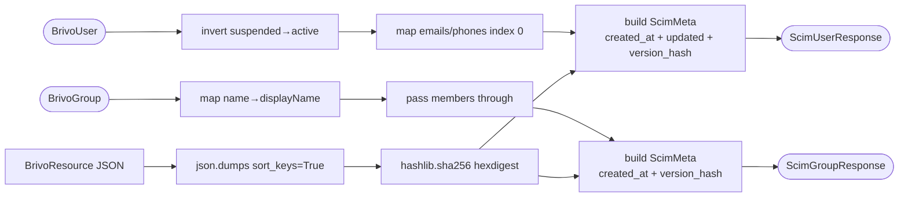

## Brainstorm

Task #22: inverse of #21 — `BrivoUser→ScimUserResponse` and `BrivoGroup→ScimGroupResponse`. Pure functions, no Redis, no HTTP.

`ScimMeta` needs three sources: `created_at` from idmap (passed in as `datetime`), `updated` from Brivo resource (already on `BrivoUser`), version hash from Brivo resource JSON (deterministic MD5/sha256 over model JSON).

Inversions:
- `suspended` → `active` (invert)
- `emails[0].address` → `emails[0].value` with `primary=True`
- `phoneNumbers[0].number` → `phoneNumbers[0].value` with `primary=True`
- `id` (int) is Brivo's target_id — caller passes SCIM `scim_id` (str) separately
- `members` already resolved (task #23 hydrates target_id→scim_id); read path just accepts `list[ScimMember]`

Constraints:
- `meta.version` must be stable for same Brivo payload (deterministic serialization)
- `meta.created` / `meta.lastModified` in ISO 8601 format (`datetime.isoformat()`)
- `meta.location` set by caller (router knows URL); default `None`

Related: [Field Mapper Write Path](20260620114246_field_mapper_write.md)

## Story

As bridge, want pure Brivo→SCIM field translation with meta computation, so responses to Okta are correctly shaped without mapping logic in callers.

AC:
1. `brivo_user_to_scim(user: BrivoUser, scim_id: str, created_at: datetime, location: str | None = None) -> ScimUserResponse` exists and is importable from `app.services.field_mapper`
2. `firstName+lastName` → `name.givenName/familyName`; `suspended` inverted to `active`
3. `emails[0].address` → `ScimEmail(value=..., type=..., primary=True)`; empty list → empty list
4. `phoneNumbers[0].number` → `ScimPhone(value=..., type=..., primary=True)`; empty list → empty list
5. `meta.created` = `created_at.isoformat()`; `meta.lastModified` = `user.updated.isoformat()`; `meta.resourceType` = `"User"`; `meta.location` = passed `location`
6. `meta.version` = deterministic hex digest of Brivo user JSON (sorted keys); same input → same version
7. `brivo_group_to_scim(group: BrivoGroup, scim_id: str, members: list[ScimMember], created_at: datetime, location: str | None = None) -> ScimGroupResponse` exists and is importable
8. `group.name` → `displayName`; `members` passed through as-is (hydration is task #23)
9. Group meta same rules as user (resourceType = `"Group"`; no `updated` on BrivoGroup → `meta.lastModified` omitted / `None`)
10. Test: user mapping — suspended inversion, name, primary email/phone set
11. Test: empty emails/phones → empty lists in response
12. Test: `meta.version` stable for identical Brivo payload
13. Test: group mapping — displayName, members passed through, meta fields correct

## Design

### Flow



### Data

```python
# user
def brivo_user_to_scim(
    user: BrivoUser,
    scim_id: str,
    created_at: datetime,
    location: str | None = None,
) -> ScimUserResponse:
    version = hashlib.sha256(
        json.dumps(user.model_dump(mode="json"), sort_keys=True).encode()
    ).hexdigest()
    return ScimUserResponse(
        id=scim_id,
        userName=user.emails[0].address if user.emails else "",
        name=ScimName(givenName=user.firstName, familyName=user.lastName),
        emails=[ScimEmail(value=e.address, type=e.type, primary=(i == 0)) for i, e in enumerate(user.emails)],
        phoneNumbers=[ScimPhone(value=p.number, type=p.type, primary=(i == 0)) for i, p in enumerate(user.phoneNumbers)],
        active=not user.suspended,
        meta=ScimMeta(
            resourceType="User",
            location=location,
            created=created_at.isoformat(),
            lastModified=user.updated.isoformat(),
            version=version,
        ),
    )

# group — BrivoGroup has no `updated` field → lastModified=None
def brivo_group_to_scim(
    group: BrivoGroup,
    scim_id: str,
    members: list[ScimMember],
    created_at: datetime,
    location: str | None = None,
) -> ScimGroupResponse:
    version = hashlib.sha256(
        json.dumps(group.model_dump(mode="json"), sort_keys=True).encode()
    ).hexdigest()
    return ScimGroupResponse(
        id=scim_id,
        displayName=group.name,
        members=members,
        meta=ScimMeta(
            resourceType="Group",
            location=location,
            created=created_at.isoformat(),
            lastModified=None,
            version=version,
        ),
    )
```

### Modules

- `app/services/field_mapper.py` — add `brivo_user_to_scim`, `brivo_group_to_scim`; add `import hashlib, json` at top
- `tests/unit/test_field_mapper.py` — extend with AC 10–13 test cases

[field_mapper.py](app/services/field_mapper.py) [test_field_mapper.py](tests/unit/test_field_mapper.py)

## Summary

Added `brivo_user_to_scim` and `brivo_group_to_scim` to `app/services/field_mapper.py`. Both are pure functions: invert `suspended→active`, map emails/phones with `primary=True` on index 0, build `ScimMeta` from caller-supplied `created_at` + Brivo's `updated` (users only) + deterministic sha256 of `model_dump(mode="json", sort_keys=True)`. `BrivoGroup` has no `updated` field so `meta.lastModified=None`. Members passed through unchanged — hydration is task #23. `_version_hash` extracted as shared helper.
