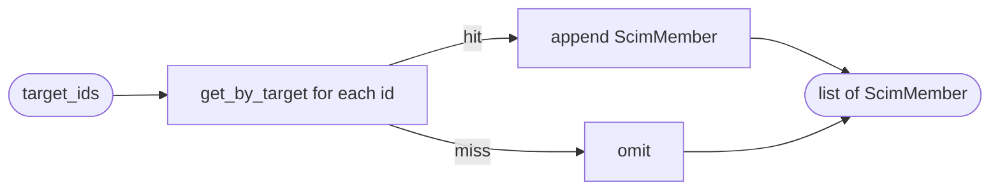

## Brainstorm

Task #23: async function that resolves a list of Brivo `target_id` integers → `list[ScimMember]` via Redis `idmap:tid` keys. Bridges gap between #22 (read path accepts `list[ScimMember]` from caller) and the saga/router that fetches Brivo group members as raw target IDs.

Scope: one function, `hydrate_members(target_ids, store)`. No HTTP, no Brivo calls — pure Redis lookups. Async because `RedisStore` is async.

Constraints:
- Missing target_id (not in idmap) → skip; member not yet provisioned is valid race condition
- `ScimMember.display` left `None` — idmap doesn't store display name
- Preserves order of input list (resolved members in same order as input, skipping unknowns)
- `rtype="user"` hardcoded — group members are always users

Related: [Field Mapper Read Path](20260620115345_field_mapper_read.md) [Field Mapper Write Path](20260620114246_field_mapper_write.md)

## Story

As saga/router, want to resolve Brivo group member target_ids to ScimMembers in one call, so group read responses include correct SCIM member IDs without idmap logic in callers.

AC:
1. `hydrate_members(target_ids: list[int], store: RedisStore) -> list[ScimMember]` is async and importable from `app.services.field_mapper`
2. Each `target_id` resolved via `store.get_by_target("user", str(target_id))` → `ScimMember(value=scim_id)`
3. `target_id` not found in idmap → silently skipped (not an error)
4. Result order matches input order (unknowns omitted, not reordered)
5. `ScimMember.display` = `None` (idmap has no display name)
6. Empty input → empty output
7. Test: all IDs found → full list returned in order
8. Test: some IDs missing → only found ones returned
9. Test: empty input → empty list
10. Test: function is async (awaitable)

## Design

### Flow



### Data

```python
input:  target_ids: list[int], store: RedisStore
output: list[ScimMember]

# per id
record = await store.get_by_target("user", str(target_id))
# record = {"scim_id": "...", "external_id": "..."} or None
member = ScimMember(value=record["scim_id"]) if record else None
```

### Modules

- `app/services/field_mapper.py` — add `hydrate_members`; add `RedisStore` import from `app.redis.store`
- `tests/unit/test_field_mapper.py` — extend with AC 7–10 (use `fakeredis` via `RedisStore`)

[field_mapper.py](app/services/field_mapper.py) [test_field_mapper.py](tests/unit/test_field_mapper.py)

## Summary

Added `hydrate_members(target_ids, store)` to `field_mapper.py` — async, resolves each Brivo int target_id to `ScimMember(value=scim_id)` via `store.get_by_target("user", str(tid))`. Missing IDs silently skipped; order preserved; `display=None` (idmap has no name). Sequential Redis lookups — good enough for group member counts in practice.
