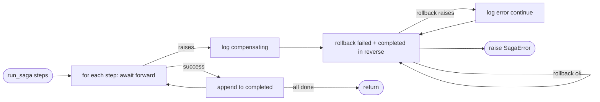

## Brainstorm

Task #24: foundation for all saga operations (#25-32). Pure async function `run_saga(steps, saga_id)` + `Step` dataclass. No subclassing — concrete sagas build a step list and call `run_saga`.

States per saga.md: saga `running→completed|compensating→compensated|failed`; step `pending→running→done|failed`. State is in-memory only — crash = lost; IdP retry + lock expiry handles recovery.

No saga-level retry — `brivo_retry` handles transient errors (429) at the HTTP boundary. Saga's job is compensation: if step fails, rollback completed steps in reverse.

`saga_id` = UUID v4, emitted in structlog on start, each step transition, failure, and completion.

Unrecoverable rollbacks (e.g., DELETE already fired): rollback callable logs alert and returns — `run_saga` does not re-raise.

Related: [Rate Limiter](20260620012831_rate_limiter.md) [Brivo Client](20260620003030_brivo_client.md)

## Story

As bridge, want a reusable step-runner with retries and rollback, so each saga defines only its step list without duplicating retry/rollback logic.

AC:
1. `Step` dataclass: `name: str`, `forward: Callable[[], Awaitable[None]]`, `rollback: Callable[[], Awaitable[None]] | None = None`
2. `run_saga(steps: list[Step]) -> None` — async, generates UUID v4 saga_id internally
3. Step failure → execute rollbacks of failed step + completed steps in reverse order; skip steps with `rollback=None`
5. Saga state transitions logged via structlog at each stage: start, each step result, rollback start, final outcome
6. `saga_id` included in every log entry
7. Rollback callable that raises → log error and continue remaining rollbacks (do not abort rollback sequence)
8. All steps succeed → returns normally (no exception)
9. Step fails → raises `SagaError` after rollback completes
10. `SagaError` carries `saga_id` and `failed_step` name
11. Test: all steps forward called in order
12. Test: step failure triggers rollback of completed steps in reverse
13. Test: step with `rollback=None` skipped during rollback
14. Test: rollback error logged but remaining rollbacks still execute
15. Test: `SagaError` raised with correct saga_id and step name on failure
16. Test: failed step's rollback is called if it has one

## Design

### Flow



### Data

```python
@dataclass
class Step:
    name: str
    forward: Callable[[], Awaitable[None]]
    rollback: Callable[[], Awaitable[None]] | None = None

class SagaError(Exception):
    saga_id: str
    failed_step: str

async def run_saga(steps: list[Step]) -> None: ...
```

### Modules

- `app/services/saga.py` — new file: `Step`, `SagaError`, `run_saga`
- `tests/unit/test_saga.py` — new file

## Summary

`run_saga` iterates steps sequentially, calling each `forward` once. On failure, rolls back the failed step + all completed steps in reverse (`[*completed, step]`) — skips `rollback=None`, swallows rollback exceptions (logs error, continues). Raises `SagaError(saga_id, failed_step)` after rollback. Including the failed step in rollback lets callers own all cleanup inside their step rollbacks rather than in `except SagaError` blocks. No saga-level retry — transient HTTP errors (429) are handled by `brivo_retry` at the client boundary.

[app/services/saga.py](app/services/saga.py) [tests/unit/test_saga.py](tests/unit/test_saga.py)
