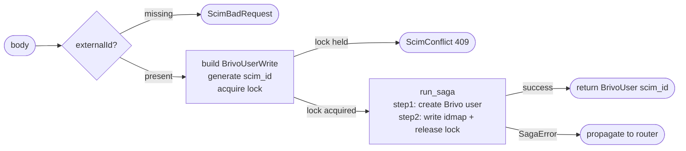

## Brainstorm

Task #25: orchestrate SCIM user creation end-to-end. Receives a SCIM user body from router, acquires idempotency lock, creates user in Brivo, writes idmap, releases lock. Returns `(BrivoUser, scim_id)` — router does SCIM mapping.

Scope: `app/services/create_user.py`. Three steps via `run_saga`: lock → POST Brivo → write idmap + DEL lock.

Constraints:
- Lock key: `lock:brivo:create:user:{external_id}` (300s TTL via `store.acquire_lock`) — 409 if already held (concurrent create in flight)
- `scim_id` = UUID v4, generated before saga starts; stable if saga retried by IdP
- Step outputs shared via closure (mutable dict between steps)
- Rollback: step 1 → release lock; step 2 → delete Brivo user; step 3 → del idmap (lock already released in forward)
- `external_id` sourced from SCIM `externalId` field

Related: [Saga Base Runner](20260620163423_saga_base_runner.md) [Field Mapper Write](20260620114246_field_mapper_write.md)

## Story

As SCIM users router, want create-user saga, so POST /Users atomically provisions Brivo user and idmap without duplicate risk.

AC:
1. `create_user(body: ScimUserRequest, store: RedisStore, client: BrivoClient) -> tuple[BrivoUser, str]` — async; returns `(brivo_user, scim_id)`
2. Raises `ScimBadRequest` (400) if `body.externalId` is missing
3. Generates `scim_id` = UUID v4; acquires lock via `store.acquire_lock("user", external_id, scim_id)` — raises `ScimConflict` (409) if already held; lock acquired before saga starts
4. Builds `BrivoUserWrite` via `scim_user_to_brivo(body)` before saga starts
5. Step 1 — "create-brivo-user": forward = `client.create_user(brivo_write)`, store result in closure; rollback = `client.delete_user(brivo_user.id)` (swallow 404) + `store.release_lock`
6. Step 2 — "write-idmap": forward = `store.set_idmap(...)` then `store.release_lock`; rollback = `store.del_idmap(...)`
7. `SagaError` propagated to caller (router maps to 500)
8. Test: happy path — lock acquired, Brivo user created, idmap written, lock released, returns `(BrivoUser, scim_id)`
9. Test: lock conflict → `ScimConflict` raised, saga never starts
10. Test: Brivo create fails → lock released (step 1 rollback), `SagaError` raised
11. Test: idmap write fails → Brivo user deleted + lock released (step 1 rollback), `SagaError` raised

## Design

### Flow



### Data

```python
# exceptions added to app/core/errors.py
class ScimConflict(Exception): ...    # 409
class ScimBadRequest(Exception): ...  # 400

# new function
async def create_user(
    body: ScimUserRequest,
    store: RedisStore,
    client: BrivoClient,
) -> tuple[BrivoUser, str]: ...

# closure shared between steps
result: dict = {}  # result["user"] = BrivoUser after step 1
```

### Modules

- `app/services/create_user.py` — new: `create_user`
- `app/core/errors.py` — add `ScimConflict`, `ScimBadRequest` exceptions
- `tests/unit/test_create_user.py` — new

## Summary

`create_user` validates `externalId`, acquires idempotency lock (ScimConflict on conflict), then runs a 2-step saga: create Brivo user, write idmap + release lock. Step 1 rollback deletes the Brivo user (swallow 404) and releases the lock — `run_saga` calls the failed step's rollback too, so lock cleanup is always owned by the saga, not by the caller. Step 2 rollback deletes idmap only.

[app/services/create_user.py](app/services/create_user.py) [app/core/errors.py](app/core/errors.py) [tests/unit/test_create_user.py](tests/unit/test_create_user.py)
