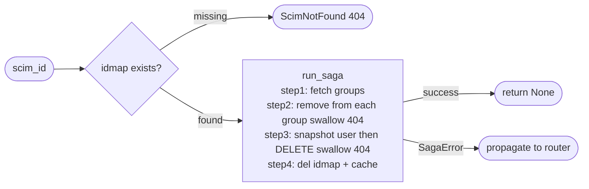

## Brainstorm

Task #26: orchestrate SCIM user deletion end-to-end. Receives `scim_id` from router, resolves to `target_id` via idmap, removes user from all Brivo groups, deletes Brivo user, DELs idmap + cache.

Scope: `app/services/delete_user.py`. Four steps via `run_saga`.

Constraints:
- Pre-saga: resolve `target_id` + `external_id` from idmap — raise `ScimNotFound` (404) if missing
- No idempotency lock — DELETE is idempotent; Brivo 404 treated as success
- Step 2 (remove-from-groups): swallow 404 per group (group already disbanded = clean); track successfully removed groups in closure for rollback
- Step 3 (delete-brivo-user): swallow 404 (already deleted = clean); snapshot BrivoUser before delete for rollback
- Rollback per step: step2 re-adds user to removed groups; step3 re-creates Brivo user; step4 re-sets idmap + cache
- `run_saga` calls each failed+completed step's rollback in reverse — full compensation achieved compositionally

Related: [Create User Saga](20260620224016_create_user_saga.md) [Saga Base Runner](20260620163423_saga_base_runner.md)

## Story

As SCIM users router, want delete-user saga, so DELETE /Users/{id} atomically removes user from Brivo, their groups, and all ID mappings.

AC:
1. `async def delete_user(scim_id: str, store: RedisStore, client: BrivoClient) -> None`
2. Pre-saga: `store.get_by_scim("user", scim_id)` → `ScimNotFound` (404) if missing; extract `target_id: str`, `external_id: str` from result
3. Step 1 "fetch-groups": `client.list_user_groups(int(target_id))` → store `list[BrivoGroupRef]` in closure; rollback = None
4. Step 2 "remove-from-groups": for each group in closure, call `client.remove_user_from_group(group.id, int(target_id))` swallowing `BrivoNotFoundError`; track removed `group.id`s in closure; rollback = `client.add_user_to_group(gid, int(target_id))` for each removed gid (swallow errors, log)
5. Step 3 "delete-brivo-user": `client.get_user(int(target_id))` → store `BrivoUser` snapshot in closure; `client.delete_user(int(target_id))` swallowing `BrivoNotFoundError`; rollback = `client.create_user(BrivoUserWrite(**snapshot_fields))` best-effort (log warning — new Brivo ID will differ from original)
6. Step 4 "del-idmap-cache": `store.del_idmap("user", scim_id, target_id, external_id)` + `store.cache_del("user", target_id)`; rollback = `store.set_idmap("user", scim_id, target_id, external_id)` + `store.cache_set("user", target_id, value=snapshot.model_dump())`
7. `SagaError` propagated to caller (router maps to 500)
8. `ScimNotFound` needs adding to `app/core/errors.py`
9. Test: happy path — groups fetched, user removed from all groups, Brivo user deleted, idmap + cache DELd
10. Test: `scim_id` not in idmap → `ScimNotFound` raised, saga never starts
11. Test: group removal 404 → swallowed, remaining groups still processed, saga completes
12. Test: Brivo DELETE fails → step 2 rollback re-adds user to removed groups, `SagaError` raised
13. Test: idmap DEL fails → step 3 rollback re-creates Brivo user, step 2 rollback re-adds to groups, `SagaError` raised

## Design

### Flow



### Data

```python
# new exception — app/core/errors.py
class ScimNotFound(Exception): ...  # 404

# new function
async def delete_user(
    scim_id: str,
    store: RedisStore,
    client: BrivoClient,
) -> None: ...

# closure shared between steps
ctx: dict = {}
# ctx["target_id"]: int         — resolved pre-saga
# ctx["external_id"]: str       — resolved pre-saga
# ctx["groups"]: list[BrivoGroupRef]  — set by step 1
# ctx["removed_gids"]: list[int]      — set by step 2 (for rollback)
# ctx["snapshot"]: BrivoUser          — set by step 3 (for rollback)
```

### Modules

- `app/services/delete_user.py` — new: `delete_user`
- `app/core/errors.py` — add `ScimNotFound` (404)
- `tests/unit/test_delete_user.py` — new

## Summary

`delete_user` resolves `scim_id` via idmap (ScimNotFound if missing), then runs 4 steps: fetch groups, remove from each (swallow 404, track removed), snapshot + delete Brivo user (swallow 404), DEL idmap + cache. Full compensation compositionally: step2 rollback re-adds to removed groups; step3 rollback re-creates from snapshot (best-effort, new ID); step4 rollback re-sets idmap + cache. `model_dump(mode="json")` used in step4 rollback to keep datetime fields JSON-safe.

[app/services/delete_user.py](app/services/delete_user.py) [app/core/errors.py](app/core/errors.py) [tests/unit/test_delete_user.py](tests/unit/test_delete_user.py)
