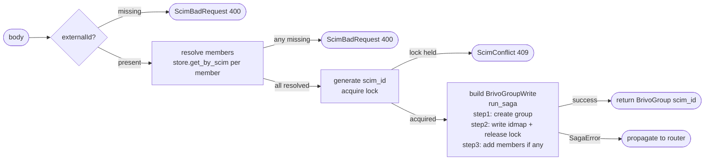

## Brainstorm

Task #27: orchestrate SCIM group creation end-to-end. Receives `ScimGroup` from router, acquires lock, creates group in Brivo, writes idmap, bulk-adds members. Returns `(BrivoGroup, scim_id)` — router does SCIM mapping.

Scope: `app/services/create_group.py`. Three steps via `run_saga` + pre-saga lock + pre-step-3 member resolution.

Constraints:
- Lock key: `lock:brivo:create:group:{external_id}` (300s TTL) — 409 if held
- `scim_id` = UUID v4, generated before saga; stable across IdP retries
- Step 3 member resolution happens before any Brivo member calls — if any `scim_id` missing from idmap → 400, abort (no compensation needed, group idmap already written)
- Track `added_members: list[int]` in closure; rollback step 3 in reverse order + DEL member cache
- `external_id` required — 400 if missing (same as create_user)

Related: [Create User Saga](20260620224016_create_user_saga.md) [Saga Base Runner](20260620163423_saga_base_runner.md) [Member Hydration](20260620161942_member_hydration.md)

## Story

As SCIM groups router, want create-group saga, so POST /Groups atomically provisions Brivo group, idmap, and initial members without duplicate risk.

AC:
1. `async def create_group(body: ScimGroup, store: RedisStore, client: BrivoClient) -> tuple[BrivoGroup, str]`
2. Raises `ScimBadRequest` (400) if `body.externalId` is missing
3. Generates `scim_id` = UUID v4; acquires lock via `store.acquire_lock("group", external_id, scim_id)` — raises `ScimConflict` (409) if held; builds `BrivoGroupWrite` via `scim_group_to_brivo(body)` before saga
4. Step 1 "create-brivo-group": `client.create_group(brivo_write)` → store result in closure; rollback = `client.delete_group(group.id)` (swallow 404) + `store.release_lock`
5. Step 2 "write-idmap": `store.set_idmap("group", scim_id, str(group.id), external_id)` + `store.release_lock`; rollback = `store.del_idmap(...)`
6. Pre-step-3: resolve all `body.members` `scim_id → target_id` via `store.get_by_scim("user", m.value)`; if any missing → raise `ScimBadRequest` (400); store `resolved: list[int]` in closure
7. Step 3 "add-members": for each `target_user_id` in resolved, `client.add_user_to_group(group.id, target_user_id)`; track `added_members: list[int]` in closure; `store.cache_del("group", str(group.id), "members")` after all adds; rollback = `client.remove_user_from_group(group.id, uid)` for each in `added_members` reversed + `store.cache_del(...)`
8. `SagaError` propagated to caller (router maps to 500)
9. Step 3 skipped entirely if `body.members` is empty
10. Test: happy path — lock acquired, group created, idmap written, lock released, members added, cache DELd, returns `(BrivoGroup, scim_id)`
11. Test: missing `externalId` → `ScimBadRequest`, no lock
12. Test: lock conflict → `ScimConflict`, saga never starts
13. Test: Brivo create fails → lock released, `SagaError`
14. Test: idmap write fails → group deleted + lock released, `SagaError`
15. Test: unresolvable member → `ScimBadRequest` after idmap written (step 2 done), saga never reaches step 3
16. Test: member add fails mid-way → already-added members removed in reverse, cache DELd, `SagaError`
17. Test: empty members → step 3 skipped, returns normally

## Design

### Flow



### Data

```python
async def create_group(
    body: ScimGroup,
    store: RedisStore,
    client: BrivoClient,
) -> tuple[BrivoGroup, str]: ...

# closure
result: dict = {}
# result["group"]: BrivoGroup      — set by step 1
# result["added"]: list[int]       — target_user_ids added in step 3 (for rollback)

# pre-saga resolved members
resolved: list[int]  # target_user_ids, same order as body.members
```

### Modules

- `app/services/create_group.py` — new: `create_group`
- `tests/unit/test_create_group.py` — new

Note: member resolution runs pre-saga (before lock) so 400 exits cleanly without needing rollback. `ScimBadRequest` and `ScimConflict` already in `app/core/errors.py`.

## Summary

`create_group` validates `externalId`, resolves all members pre-saga (ScimBadRequest on any missing — before lock so 400 is clean with no rollback), acquires idempotency lock (ScimConflict on conflict), then runs 2-or-3-step saga: create Brivo group, write idmap + release lock, optionally add members. Step 3 only appended to saga when resolved members list is non-empty. Step 3 rollback removes added members in reverse + DELs member cache; step 1 rollback deletes Brivo group (swallow 404) + releases lock.

[app/services/create_group.py](app/services/create_group.py) [tests/unit/test_create_group.py](tests/unit/test_create_group.py)
