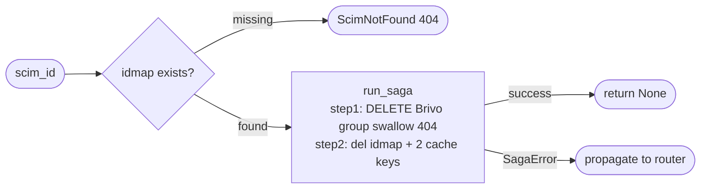

## Brainstorm

Task #28: orchestrate SCIM group deletion end-to-end. Receives `scim_id` from router, resolves to `target_group_id` via idmap, deletes Brivo group, DELs idmap + cache. Returns nothing.

Scope: `app/services/delete_group.py`. Two steps via `run_saga`.

Constraints:
- Pre-saga: resolve `target_group_id` + `external_id` from idmap — raise `ScimNotFound` (404) if missing
- No idempotency lock — DELETE is idempotent; Brivo 404 treated as success
- Step 1 rollback: unrecoverable — log structured alert, do not re-raise (saga continues rollback sequence); Brivo group is gone
- Step 2 DELs 4 keys: 3 idmap keys + `cache:brivo:group:{target_group_id}` + `cache:brivo:group:{target_group_id}:members`; rollback = restore idmap (cache loss acceptable)
- Brivo handles member removal implicitly on group delete — no explicit member removal step needed

Related: [Delete User Saga](20260621214453_delete_user_saga.md) [Create Group Saga](20260622074246_create_group_saga.md) [Saga Base Runner](20260620163423_saga_base_runner.md)

## Story

As SCIM groups router, want delete-group saga, so DELETE /Groups/{id} atomically removes group from Brivo and all ID mappings.

AC:
1. `async def delete_group(scim_id: str, store: RedisStore, client: BrivoClient) -> None`
2. Pre-saga: `store.get_by_scim("group", scim_id)` → `ScimNotFound` (404) if missing; extract `target_id: str`, `external_id: str`
3. Step 1 "delete-brivo-group": `client.delete_group(int(target_id))` swallowing `BrivoNotFoundError`; rollback = log structured alert `"rollback.delete_group.unrecoverable"` with `target_id` (group is gone, no re-creation)
4. Step 2 "del-idmap-cache": `store.del_idmap("group", scim_id, target_id, external_id)` + `store.cache_del("group", target_id)` + `store.cache_del("group", target_id, "members")`; rollback = `store.set_idmap("group", scim_id, target_id, external_id)` (cache loss acceptable)
5. `SagaError` propagated to caller (router maps to 500)
6. Test: happy path — group deleted from Brivo, 3 idmap keys DELd, 2 cache keys DELd
7. Test: `scim_id` not in idmap → `ScimNotFound`, saga never starts
8. Test: Brivo DELETE 404 → swallowed, saga continues to step 2
9. Test: Brivo DELETE fails (non-404) → step 1 rollback logs alert, `SagaError` raised
10. Test: idmap DEL fails → step 1 rollback logs alert, step 2 rollback restores idmap, `SagaError` raised

## Design

### Flow



### Data

```python
async def delete_group(
    scim_id: str,
    store: RedisStore,
    client: BrivoClient,
) -> None: ...

# resolved pre-saga
target_id: str   # str form of Brivo group ID
external_id: str
```

### Modules

- `app/services/delete_group.py` — new: `delete_group`
- `tests/unit/test_delete_group.py` — new

`ScimNotFound` already in `app/core/errors.py`.

## Summary

`delete_group` resolves `scim_id` via idmap (ScimNotFound if missing), then runs 2 steps: DELETE Brivo group (swallow 404), DEL 3 idmap keys + 2 cache keys. Step 1 rollback is unrecoverable — logs structured alert and returns (group is gone from Brivo; IdP must re-provision). Step 2 rollback restores idmap only; member cache loss is acceptable since the group no longer exists.

[app/services/delete_group.py](app/services/delete_group.py) [tests/unit/test_delete_group.py](tests/unit/test_delete_group.py)
