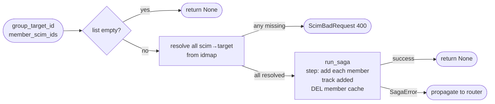

## Brainstorm

Task #29: add one or more members to an existing Brivo group via SCIM PATCH `add`. Router resolves `scim_group_id → target_group_id` (404 if missing) before calling saga. Saga receives `target_group_id` + list of member `scim_id`s, resolves all to target user IDs upfront (400 if any missing), then PUTs each to Brivo and invalidates member cache.

Scope: `app/services/add_members.py`. Two steps via `run_saga`.

Constraints:
- No idempotency lock — Brivo PUT member is idempotent
- Member resolution pre-saga: all `scim_user_id → target_user_id` resolved before any Brivo calls; 400 if any missing
- Track `added: list[int]` in closure; step 2 rollback removes in reverse + DEL cache
- DEL `cache:brivo:group:{target_group_id}:members` after all adds (and in rollback)
- Router owns group resolution; saga receives `target_group_id: int` directly

Related: [Create Group Saga](20260622074246_create_group_saga.md) [Saga Base Runner](20260620163423_saga_base_runner.md)

## Story

As SCIM groups router, want add-members saga, so PATCH /Groups/{id} `add` op atomically adds N members to Brivo group with full rollback on failure.

AC:
1. `async def add_members(group_target_id: int, member_scim_ids: list[str], store: RedisStore, client: BrivoClient) -> None`
2. Pre-saga: for each `scim_id` in `member_scim_ids`, `store.get_by_scim("user", scim_id)` — raises `ScimBadRequest` (400) if any missing; builds `resolved: list[int]` of target user IDs
3. Step 1 "resolve": no-op forward (resolution already done pre-saga); rollback = None
4. Step 2 "add-members": for each `target_user_id` in resolved, `client.add_user_to_group(group_target_id, target_user_id)`; append to `added: list[int]` in closure; after all adds `store.cache_del("group", str(group_target_id), "members")`; rollback = `client.remove_user_from_group(group_target_id, uid)` for each in `added` reversed + `store.cache_del(...)`
5. `SagaError` propagated to caller
6. Empty `member_scim_ids` → returns immediately (no saga)
7. Test: happy path — all members resolved and added, cache DELd
8. Test: unresolvable member → `ScimBadRequest`, no Brivo calls
9. Test: member add fails mid-way → added members removed in reverse + cache DELd, `SagaError`
10. Test: empty list → returns without calling Brivo

## Design

### Flow



### Data

```python
async def add_members(
    group_target_id: int,
    member_scim_ids: list[str],
    store: RedisStore,
    client: BrivoClient,
) -> None: ...

# closure
ctx: dict = {"added": []}  # list[int] of added target_user_ids
```

### Modules

- `app/services/add_members.py` — new: `add_members`
- `tests/unit/test_add_members.py` — new

`ScimBadRequest` already in `app/core/errors.py`. No lock — Brivo PUT member is idempotent.

## Summary

`add_members` returns immediately on empty list. Otherwise resolves all `scim_id → target_user_id` pre-saga (ScimBadRequest if any missing), then runs a single-step saga: PUT each member in order tracking `added`, DEL member cache after all adds. Rollback removes added members in reverse (swallow errors) + DEL cache. No lock because Brivo PUT member is idempotent.

[app/services/add_members.py](app/services/add_members.py) [tests/unit/test_add_members.py](tests/unit/test_add_members.py)
