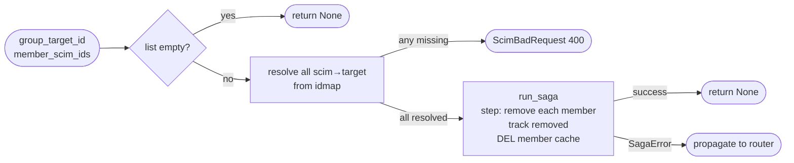

## Brainstorm

Task #30: remove one or more members from existing Brivo group via SCIM PATCH `remove`. Router resolves `scim_group_id → target_group_id` (404 if missing) before calling saga. Saga receives `target_group_id` + list of member `scim_id`s, resolves all to target user IDs upfront (400 if any missing), then DELETEs each from Brivo and invalidates member cache.

Scope: `app/services/remove_members.py`. Mirror of add_members pattern.

Constraints:
- No idempotency lock — Brivo DELETE member is idempotent
- Member resolution pre-saga: all `scim_user_id → target_user_id` resolved before any Brivo calls; 400 if any missing
- Track `removed: list[int]` in closure; step rollback re-adds in reverse + DEL cache
- DEL `cache:brivo:group:{target_group_id}:members` after all removes (and in rollback)
- Router owns group resolution; saga receives `target_group_id: int` directly
- Empty list → return immediately, no saga

Related: [Add Members Saga](20260622083608_add_members_saga.md) [Saga Base Runner](20260620163423_saga_base_runner.md)

## Story

As SCIM groups router, want remove-members saga, so PATCH /Groups/{id} `remove` op atomically removes N members from Brivo group with full rollback on failure.

AC:
1. Empty member list → no-op, returns immediately
2. Any member not found in idmap → 400, no Brivo calls made
3. All members resolved → each removed from Brivo group in order
4. Member cache invalidated after all removes succeed
5. Brivo remove fails mid-way → previously removed members re-added in reverse, cache invalidated, error propagated
6. Happy path with N members → all removed, cache cleared
7. Unresolvable member → 400, zero Brivo calls
8. Mid-saga failure → full rollback, SagaError raised

## Design

### Flow



### Data

```python
async def remove_members(
    group_target_id: int,
    member_scim_ids: list[str],
    store: RedisStore,
    client: BrivoClient,
) -> None: ...

# closure
ctx: dict = {"removed": []}  # list[int] of removed target_user_ids
```

### Modules

- `app/services/remove_members.py` — new: `remove_members`
- `tests/unit/test_remove_members.py` — new

## Summary

`remove_members` mirrors `add_members`: returns immediately on empty list, resolves all `scim_id → target_user_id` pre-saga (ScimBadRequest if any missing), then runs single-step saga deleting each member in order tracking `removed`, DEL member cache after all removes. Rollback re-PUTs removed members in reverse (swallow errors) + DEL cache. No lock — Brivo DELETE member is idempotent.

[app/services/remove_members.py](app/services/remove_members.py) [tests/unit/test_remove_members.py](tests/unit/test_remove_members.py)
