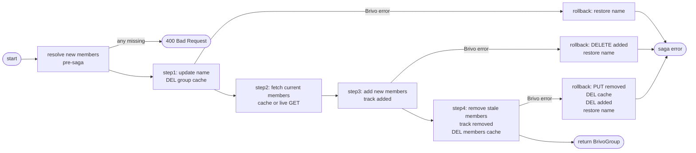

## Brainstorm

Task #31: orchestrate SCIM group full replace (PUT). Handles both attribute update (name) and member list diff in one saga. Router resolves `scim_group_id → target_group_id` (404 if missing) before calling saga.

Scope: `app/services/update_group.py`. Five steps via `run_saga`.

Constraints:
- Step 1: update group name in Brivo + DEL group cache; rollback = restore original name
- Step 2: fetch current member list from cache (miss → Brivo GET); read-only, no rollback
- Step 3: resolve all new `scim_id → target_user_id` upfront (400 if any missing); no rollback
- Step 4: add new members (diff); track `added_members`; rollback = DELETE each in reverse
- Step 5: remove stale members (diff); track `removed_members`; DEL member cache; rollback = PUT each back + DEL cache
- No idempotency lock (member ops idempotent; attribute PUT via tenacity)

Related: [Add Members Saga](20260622083608_add_members_saga.md), [Remove Members Saga](20260622151003_remove_members_saga.md), [Create Group Saga](20260622074246_create_group_saga.md)

## Story

As bridge, want to replace a Brivo group's name and member list atomically, so Okta PUT is fully reflected in Brivo with rollback on partial failure.

AC:
1. Router resolves `scim_group_id → target_group_id` via idmap; 404 if missing
2. Saga updates group name in Brivo; rollback restores original name on failure
3. Saga fetches current Brivo member list from cache (miss → live GET)
4. All new member `scim_id`s resolved to `target_user_id` upfront; 400 if any unresolvable
5. New members (in new list but not current) added via PUT to Brivo; rollback DELETEs each in reverse
6. Stale members (in current but not new list) removed via DELETE from Brivo; rollback re-PUTs each
7. Member cache (`cache:brivo:group:{target_group_id}:members`) invalidated after step 5+6
8. Returns `(BrivoGroup, scim_id)` — router maps to SCIM response

## Design

### Flow



### Data

```
input:  { target_group_id: int, scim_id: str, body: ScimGroup, store: RedisStore, client: BrivoClient }
output: tuple[BrivoGroup, str]   # (updated group, scim_id)

ctx: {
  original_name: str,
  current_target_ids: set[int],
  added: list[int],
  removed: list[int],
}
```

### Modules

- `app/services/update_group.py` — new; `update_group(target_group_id, scim_id, body, store, client)`
- `tests/unit/test_update_group.py` — new; covers: name update, member add, member remove, mixed diff, 400 on unresolvable member

[update_group.py](app/services/update_group.py) [test_update_group.py](tests/unit/test_update_group.py)

## Summary

Implemented `update_group` saga: 4 steps (update name, fetch members, add new, remove stale) plus pre-saga member resolution. Preserves `keypadUnlock`/`immuneToAntipassback`/`antipassbackResetTime` from current Brivo group when writing new name. Members cache checked before live GET; always invalidated by step4 regardless of whether any removes occurred.
