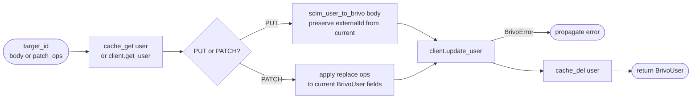

## Brainstorm

Task #32: SCIM PUT/PATCH replace for users — read-modify-write against Brivo, no saga needed. Single atomic PUT to Brivo; nothing to roll back on failure. Router resolves `scim_id → target_id` (404 if missing) before calling service.

Scope: `app/services/update_user.py`. No saga runner — direct async function.

Constraints:
- Read `cache:brivo:user:{target_id}` first (miss → `GET /target/users/{target_id}`); merge incoming fields into full `BrivoUserWrite`
- PUT replaces all mapped fields; PATCH replace applies only specified fields to the cached/fetched object
- `tenacity` retries already inside `BrivoClient._call` — no extra retry logic needed here
- DEL `cache:brivo:user:{target_id}` after successful PUT
- Return `BrivoUser` — router maps to SCIM response via `brivo_to_scim_user`
- No idempotency lock — PUT is idempotent; concurrent requests converge on last-writer-wins

Related: [Field Mapper Write Path](20260620114246_field_mapper_write.md), [Field Mapper Read Path](20260620115345_field_mapper_read.md), [Brivo Client](20260620003030_brivo_client.md)

## Story

As SCIM users router, want update-user service, so PUT and PATCH replace ops are applied to Brivo with cache-coherent read-modify-write and no partial state risk.

AC:
1. Reads current `BrivoUser` from `cache:brivo:user:{target_id}`; on miss: GET from Brivo
2. PUT path: builds full `BrivoUserWrite` from `scim_user_to_brivo(body)`; preserves `externalId` from current Brivo user
3. PATCH scalar replace (e.g. `active`, `name.givenName`): applies only the specified fields to current Brivo user, builds `BrivoUserWrite`
4. PUTs updated user to Brivo — no extra retry logic (already in `BrivoClient._call`)
5. DELs `cache:brivo:user:{target_id}` after successful PUT
6. Returns updated `BrivoUser` — router calls `brivo_user_to_scim` for the response
7. No rollback — single Brivo write; any error propagates to caller unchanged

## Design

### Flow



### Data

```
input:  { target_id: int, body: ScimUser | None, patch_ops: list[PatchOp] | None,
          store: RedisStore, client: BrivoClient }
output: BrivoUser

PATCH scalar replace mappings:
  "active"         → suspended = not value
  "name.givenName" → firstName = value
  "name.familyName"→ lastName = value
  "userName"       → emails[0].address = value
  unknown path     → ignored (no Brivo equivalent)
```

### Modules

- `app/services/update_user.py` — new; `update_user(target_id, body, patch_ops, store, client)`
- `tests/unit/test_update_user.py` — new; covers: PUT full replace, PATCH active, PATCH name fields, cache miss fallback, cache invalidation, error propagation

[update_user.py](app/services/update_user.py) [test_update_user.py](tests/unit/test_update_user.py)

## Summary

Implemented `update_user`: reads current BrivoUser from cache (miss → GET), then either maps full ScimUser body (PUT) or applies scalar PatchOps (PATCH replace) to current state. PUT preserves `externalId` from Brivo via `model_copy` since `scim_user_to_brivo` doesn't carry it. Cache DEL only on success — error propagates unchanged, no partial state.
