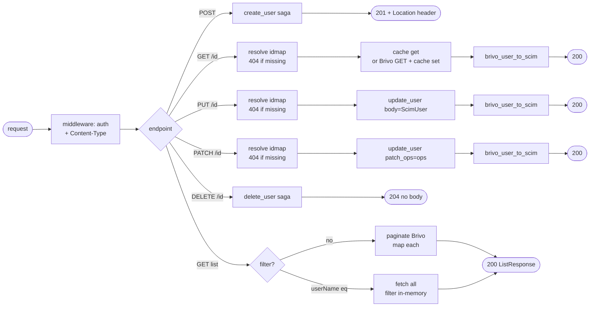

## Brainstorm

Task #33: implement all 6 SCIM user endpoints in `app/routers/users.py`. Router owns idmap resolution (scim_id → target_id), auth is middleware, SCIM mapping is field_mapper. Calls into existing sagas and services — no business logic here.

Scope: `app/routers/users.py`. Six endpoints on `/scim/v2/Users`.

Constraints:
- Auth via existing middleware (no per-route auth logic)
- All responses: `Content-Type: application/scim+json; charset=UTF-8`
- GET list: pagination via `startIndex`/`count` params; filter by `userName` (case-insensitive `eq`)
- GET /{id}: populate `cache:brivo:user:{target_id}` on miss; return with `brivo_user_to_scim`
- PUT + PATCH replace: call `update_user` service; router resolves idmap first (404 if missing)
- PATCH: dispatch ops — `replace` scalar → `update_user`; other ops not applicable to users
- DELETE: call `delete_user` saga; 204 on success
- POST: call `create_user` saga; 201 on success
- SCIM errors from `app/core/errors.py` handlers (already wired — don't add per-route try/except for SCIM errors)

Related: [SCIM User Models](20260618133057_scim_user_models.md), [Create User Saga](20260620224016_create_user_saga.md), [Delete User Saga](20260621214453_delete_user_saga.md), [Update User](20260626181612_update_user.md), [Field Mapper Read Path](20260620115345_field_mapper_read.md)

## Story

As SCIM users router, want all 6 user endpoints wired to services and sagas, so Okta can provision, update, and deprovision users end-to-end.

AC:
1. `POST /scim/v2/Users`: parse `ScimUser` body → `create_user` saga → 201 with `Location: /scim/v2/Users/{scim_id}` header and full `ScimUserResponse` body
2. `GET /scim/v2/Users/{id}`: resolve `scim_id → target_id` (404 if missing) → `cache:brivo:user:{target_id}` (miss → Brivo GET + cache set) → `brivo_user_to_scim` → 200
3. `PUT /scim/v2/Users/{id}`: resolve idmap (404 if missing) → `update_user(target_id, body=ScimUser, patch_ops=None)` → `brivo_user_to_scim` → 200
4. `PATCH /scim/v2/Users/{id}`: resolve idmap (404 if missing) → parse `PatchRequest` → `update_user(target_id, body=None, patch_ops=ops)` → `brivo_user_to_scim` → 200
5. `DELETE /scim/v2/Users/{id}`: `delete_user(scim_id)` saga → 204 no body
6. `GET /scim/v2/Users` (no filter): paginate Brivo (`startIndex`→`offset=startIndex-1`, `count`→`pageSize`; defaults 1/100) → map each to `ScimUserResponse` → `ListResponse` with `totalResults` from Brivo `count`, `itemsPerPage` = len(resources)
7. `GET /scim/v2/Users?filter=userName eq "..."`: fetch all users from Brivo (paginate until exhausted); filter in-memory case-insensitive on `emails[0].address`; return `ListResponse` (`totalResults=1` or `0`)
8. All responses: `Content-Type: application/scim+json; charset=UTF-8`
9. `brivo_user_to_scim` called with `scim_id`, `created_at` (from idmap record), and `location` (`/scim/v2/Users/{scim_id}`)

## Design

### Flow



### Data

```
GET  /Users          → ListResponse[ScimUserResponse]
POST /Users          → ScimUserResponse (201)
GET  /Users/{id}     → ScimUserResponse (200)
PUT  /Users/{id}     → ScimUserResponse (200)
PATCH /Users/{id}    → ScimUserResponse (200)
DELETE /Users/{id}   → 204 no body

Dependencies injected: RedisStore (Depends(get_store)), BrivoClient (Depends(get_client))
brivo_user_to_scim args: (brivo_user, scim_id, created_at, location)
```

### Modules

- `app/routers/users.py` — new; `APIRouter(prefix="/scim/v2/Users")`; all 6 endpoints
- `tests/integration/test_users_router.py` — new; `httpx.AsyncClient` + `fakeredis` + `respx`; covers all 6 endpoints happy path + 404/409

[users.py](app/routers/users.py) [test_users_router.py](tests/integration/test_users_router.py) [dependencies.py](app/brivo/dependencies.py) [main.py](main.py)

## Summary

Router wires all 6 SCIM user endpoints to `create_user`, `delete_user`, `update_user` sagas/services and `brivo_user_to_scim` field mapper. idmap resolution (scim_id → target_id) happens in the router before every service call; ScimNotFound raised on miss. GET /{id} delegates cache-aside fetch to `fetch_user` from `app/brivo/fetch`. list_users paginates Brivo directly; filter path fetches all then filters in-memory on emails[0].address. All SCIM error types handled in main.py exception handlers; BearerTokenMiddleware sets Content-Type on all responses.
