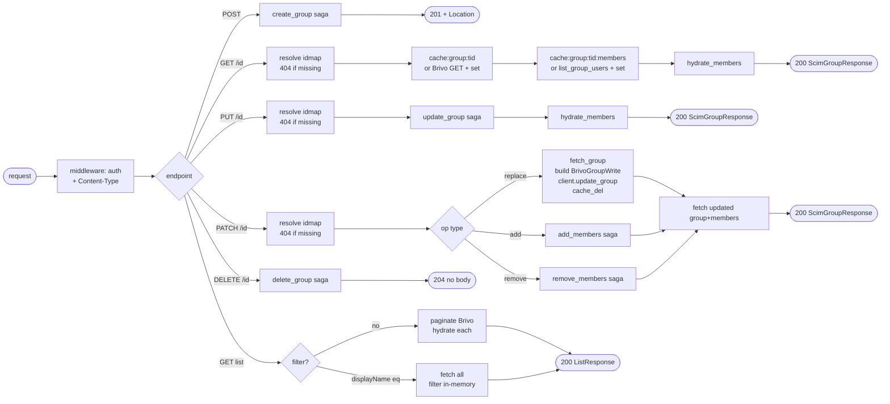

## Brainstorm

Task #34: implement all 6 SCIM group endpoints in `app/routers/groups.py`. Router owns idmap resolution (scim_id → target_id), auth is middleware, SCIM mapping is field_mapper. Delegates to existing sagas/services — no business logic here.

Scope: `app/routers/groups.py`. Six endpoints on `/scim/v2/Groups`.

Constraints:
- Auth via existing middleware (no per-route auth logic)
- All responses: `Content-Type: application/scim+json; charset=UTF-8`
- GET /{id}: check `cache:brivo:group:{target_id}` (group) and `cache:brivo:group:{target_id}:members` (member list); populate on miss; `hydrate_members` → `brivo_group_to_scim`
- GET list: paginate Brivo; filter by `displayName eq "..."` (case-insensitive, in-memory)
- POST: `create_group` saga → 201 + `Location` header
- PUT: `update_group` saga (full replace incl. member sync)
- PATCH: dispatch by op — `replace` → `fetch_group` + inline PUT to Brivo + `cache_del` (no saga, tenacity via client); `add` → `add_members` saga; `remove` → `remove_members` saga
- DELETE: `delete_group` saga → 204
- SCIM errors from `app/core/errors.py` (don't add per-route try/except for SCIM errors)

Related: [Users Router](20260626184259_users_router.md), [SCIM Group Models](20260618143212_scim_group_models.md), [Create Group Saga](20260622074246_create_group_saga.md), [Delete Group Saga](20260622081041_delete_group_saga.md), [Add Members Saga](20260622083608_add_members_saga.md), [Remove Members Saga](20260622151003_remove_members_saga.md), [Update Group Saga](20260624172255_update_group_saga.md)

## Story

As SCIM groups router, want all 6 group endpoints wired to services and sagas, so Okta can provision, update, and deprovision groups end-to-end.

AC:
1. `POST /scim/v2/Groups`: parse `ScimGroup` body → `create_group` saga → 201 with `Location: /scim/v2/Groups/{scim_id}` header and full `ScimGroupResponse` body
2. `GET /scim/v2/Groups/{id}`: resolve `scim_id → target_id` (404 if missing) → `cache:brivo:group:{target_id}` (miss → Brivo GET + cache set) → `cache:brivo:group:{target_id}:members` (miss → `list_group_users` + cache set) → `hydrate_members` → `brivo_group_to_scim` → 200
3. `PUT /scim/v2/Groups/{id}`: resolve idmap (404 if missing) → `update_group(target_id, scim_id, body, store, client)` → `hydrate_members` → `brivo_group_to_scim` → 200
4. `PATCH /scim/v2/Groups/{id}`: resolve idmap (404 if missing) → parse `PatchRequest` → dispatch each op: `replace` → `fetch_group` + `client.update_group` + `cache_del`; `add` → `add_members(target_id, member_scim_ids, store, client)`; `remove` → `remove_members(target_id, member_scim_ids, store, client)` → fetch updated group + members → `brivo_group_to_scim` → 200
5. `DELETE /scim/v2/Groups/{id}`: `delete_group(scim_id, store, client)` saga → 204 no body
6. `GET /scim/v2/Groups` (no filter): paginate Brivo (`startIndex`→`offset=startIndex-1`, `count`→`pageSize`; defaults 1/100) → for each group resolve idmap + hydrate members → `brivo_group_to_scim` → `ListResponse` with `totalResults` from Brivo `count`, `itemsPerPage=len(resources)`
7. `GET /scim/v2/Groups?filter=displayName eq "..."`: fetch all groups from Brivo (paginate until exhausted); filter in-memory case-insensitive on `group.name`; return `ListResponse` (`totalResults=1` or `0`)
8. All responses: `Content-Type: application/scim+json; charset=UTF-8`
9. `brivo_group_to_scim` args: `(brivo_group, scim_id, members, created_at, location)`

## Design

### Flow



### Data

```
GET  /Groups          → ListResponse[ScimGroupResponse]
POST /Groups          → ScimGroupResponse (201)
GET  /Groups/{id}     → ScimGroupResponse (200)
PUT  /Groups/{id}     → ScimGroupResponse (200)
PATCH /Groups/{id}    → ScimGroupResponse (200)
DELETE /Groups/{id}   → 204 no body

Dependencies injected: RedisStore (Depends(get_store)), BrivoClient (Depends(get_client))
brivo_group_to_scim args: (brivo_group, scim_id, members, created_at, location)
hydrate_members args: (target_ids: list[int], store)

PATCH replace value forms:
  {"op":"replace","value":{"displayName":"X"}}      → path=None, extract from value dict
  {"op":"replace","path":"displayName","value":"X"}  → path="displayName", value is str
PATCH add/remove value: list[{"value": "<scim_id>"}]
```

### Modules

- `app/routers/groups.py` — new; `APIRouter(prefix="/scim/v2/Groups")`; all 6 endpoints + `_apply_filter` helper + `_fetch_group_response` helper (delegates to `app/brivo/fetch`, hydrates, maps)
- `app/brivo/fetch.py` — `fetch_user`, `fetch_group`, `fetch_group_members`: cache-aside fetch helpers (cache read → Brivo GET on miss → cache set)
- `tests/integration/test_groups_router.py` — new; `httpx.AsyncClient` + `fakeredis` + `respx`; covers all 6 endpoints happy path + 404 + PATCH dispatch

[groups.py](app/routers/groups.py) [test_groups_router.py](tests/integration/test_groups_router.py) [main.py](main.py) [conftest.py](tests/conftest.py)

## Summary

Router wires all 6 SCIM group endpoints to `create_group`, `delete_group`, `update_group`, `add_members`, `remove_members` sagas/services and `brivo_group_to_scim` field mapper. `_fetch_group_response` helper centralises the cache→Brivo→hydrate→map pattern used by GET, PUT, and PATCH; cache-aside fetch delegated to `fetch_group` / `fetch_group_members` in `app/brivo/fetch`. PATCH dispatches by op: `replace` runs inline (no saga) fetching current group attrs to preserve keypad settings; `add`/`remove` delegate to their respective sagas. List endpoint uses cache-only member hydration to avoid N+1 Brivo calls. Also fixed conftest.py to force-set `SCIM_BEARER_TOKEN` via direct assignment instead of `setdefault` — env already had `change-me` from the `.env` file loaded in the shell.
