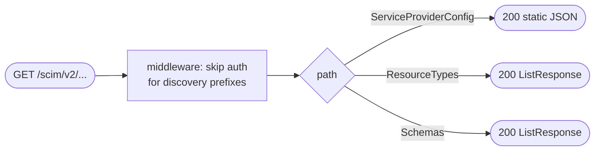

## Brainstorm

Task #35: implement 3 unauthenticated SCIM discovery endpoints in `app/routers/discovery.py`. Auth middleware already exempts these paths — no token required. All responses are static JSON (no Brivo calls, no Redis).

Scope: `app/routers/discovery.py`. Three endpoints under `/scim/v2/`.

Constraints:
- `GET /scim/v2/ServiceProviderConfig` — static body per scim-server.md; Okta reads this to enable PATCH mode; must be correct or Okta falls back to PUT-only
- `GET /scim/v2/ResourceTypes` — static `ListResponse` with User + Group entries
- `GET /scim/v2/Schemas` — static `ListResponse` with full RFC 7643 attribute definitions for User and Group schemas; Runscope validates this
- Auth middleware exempts these three paths; also note `_DISCOVERY_PREFIXES` in auth.py is missing `/scim/v2/ResourceTypes` — must fix
- No auth, no pagination, no external calls — pure static responses

## Story

As SCIM discovery router, want all 3 discovery endpoints returning valid static bodies, so Okta enables PATCH mode and Runscope compliance tests pass without authentication.

AC:
1. `GET /scim/v2/ServiceProviderConfig`: returns 200 with static body per scim-server.md — `patch.supported=true`, `filter.supported=true`, `etag.supported=true`, `bulk/changePassword/sort.supported=false`
2. `GET /scim/v2/ResourceTypes`: returns 200 with `ListResponse` containing User and Group resource type entries (`id`, `name`, `endpoint`, `schema`)
3. `GET /scim/v2/Schemas`: returns 200 with `ListResponse` containing full RFC 7643 attribute definitions for `urn:ietf:params:scim:schemas:core:2.0:User` and `urn:ietf:params:scim:schemas:core:2.0:Group`
4. All 3 endpoints return 200 without `Authorization` header
5. `app/core/auth.py` `_DISCOVERY_PREFIXES` includes `/scim/v2/ResourceTypes` (bug fix)

## Design

### Flow



### Data

```
GET /scim/v2/ServiceProviderConfig → dict (static)
GET /scim/v2/ResourceTypes        → ListResponse (totalResults=2, Resources=[User,Group])
GET /scim/v2/Schemas              → ListResponse (totalResults=2, Resources=[UserSchema,GroupSchema])

All responses: JSONResponse (no auth required, Content-Type set by middleware)
```

### Modules

- `app/routers/discovery.py` — new; `APIRouter(prefix="/scim/v2")`; 3 endpoints; all bodies as module-level constants
- `app/core/auth.py` — add `"/scim/v2/ResourceTypes"` to `_DISCOVERY_PREFIXES`
- `tests/unit/test_discovery_router.py` — new; 3 happy-path tests (no auth header); 1 test per endpoint validates key fields

[discovery.py](app/routers/discovery.py) [test_discovery_router.py](tests/unit/test_discovery_router.py) [main.py](main.py)

## Summary

Three static discovery endpoints wired to unauthenticated paths already exempted by auth middleware. All response bodies are module-level constants — no external calls, no dependencies injected. `/scim/v2/ResourceTypes` was already present in `_DISCOVERY_PREFIXES` in auth.py. Schemas response includes minimal but valid RFC 7643 attribute definitions for User and Group that Runscope validates.
