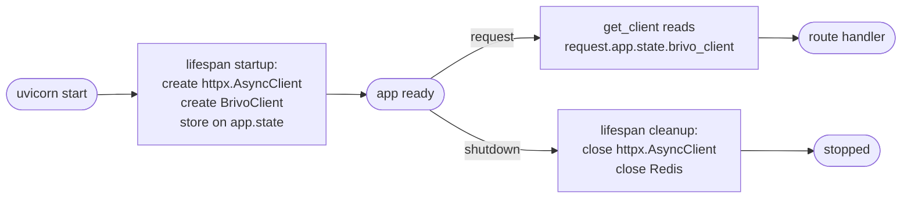

## Brainstorm

Task #36: finalize `main.py` with a lifespan context manager and fix `app/brivo/dependencies.py` which creates a new `httpx.AsyncClient` per request (connection leak, no pooling).

Scope: `main.py` + `app/brivo/dependencies.py`. No new features — wire existing pieces correctly.

Constraints:
- Lifespan: create shared `httpx.AsyncClient` + `BrivoClient` at startup, store on `app.state`; close client on shutdown; close Redis connection on shutdown
- `get_client` updated to read `BrivoClient` from `request.app.state` — standard FastAPI pattern; test overrides (`app.dependency_overrides`) bypass this so tests unaffected
- `get_store` stays as-is (Redis lazy-init in `store.py` is acceptable; lifespan closes it on shutdown)
- No new routers, no new middleware — assembly already complete in earlier tasks

## Story

As the app entry point, want proper resource lifecycle management, so connections are pooled, cleaned up on shutdown, and the app starts correctly in Docker.

AC:
1. `main.py` has an `asynccontextmanager` lifespan: creates `httpx.AsyncClient` + `BrivoClient` at startup, stores on `app.state.brivo_client`; closes both on shutdown
2. `main.py` lifespan closes the Redis connection on shutdown via `get_redis().aclose()`
3. `app/brivo/dependencies.py` `get_client(request: Request) -> BrivoClient` reads from `request.app.state.brivo_client` — no longer creates a new client per request
4. All existing tests pass (dependency overrides bypass `request.app.state`)
5. `FastAPI(lifespan=lifespan)` is the only change to app instantiation
6. `configure_logging()` called first thing inside lifespan — structlog configured before any requests
7. `RequestLoggingMiddleware` registered on app — logs every request as `http.request` via structlog; uvicorn access logs suppressed via `--no-access-log` in `Dockerfile`

## Design

### Flow



### Data

```
app.state.brivo_client: BrivoClient  (set in lifespan, read by get_client)

get_client signature change:
  before: async def get_client() -> BrivoClient
  after:  def get_client(request: Request) -> BrivoClient
```

### Modules

- `main.py` — add `lifespan` asynccontextmanager; pass to `FastAPI(lifespan=lifespan)`
- `app/brivo/dependencies.py` — update `get_client` to accept `Request`, read from `app.state`
- `tests/unit/test_app_lifespan.py` — new; verify lifespan sets `app.state.brivo_client` on startup

[main.py](main.py) [dependencies.py](app/brivo/dependencies.py) [test_app_lifespan.py](tests/unit/test_app_lifespan.py)

## Summary

Added `lifespan` asynccontextmanager to `main.py`: creates shared `httpx.AsyncClient` + `BrivoClient` at startup on `app.state.brivo_client`, closes both on shutdown alongside Redis. Simplified `get_client` to a sync one-liner reading from `app.state` — no more per-request client creation. Integration test overrides (`lambda: brivo_client`) still work since FastAPI override bypasses the dependency signature entirely. Test invokes `lifespan(app)` directly — `ASGITransport` doesn't trigger ASGI lifespan.
